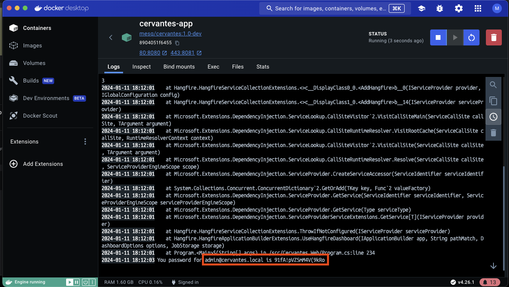

# Default User and Password

When you first launch the Cervantes application, a default user is created for you. The default username is `admin@cervantes.local`.

The password for this user is generated randomly during the creation of the application container and the first launch of the application. This means that the password is unique for each instance of the application and provides an additional layer of security.

<figure markdown>
  { width="800" }
  <figcaption>Docker log password example</figcaption>
</figure>

Please note that it's important to change the default password as soon as possible to ensure the security of your application. You can do this by logging in with the default user and navigating to the user settings page.

Remember, the security of your application is paramount. Always use strong, unique passwords and change them regularly.
