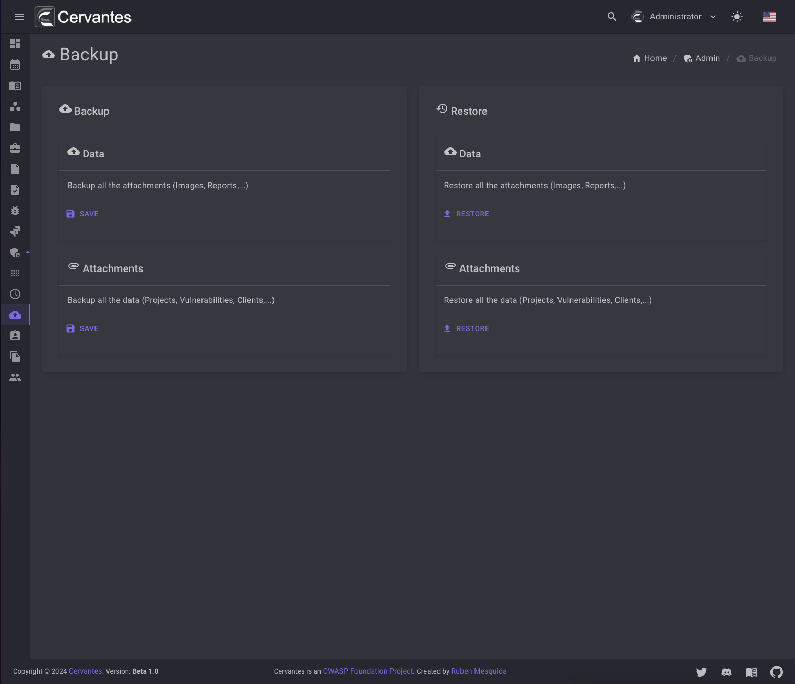
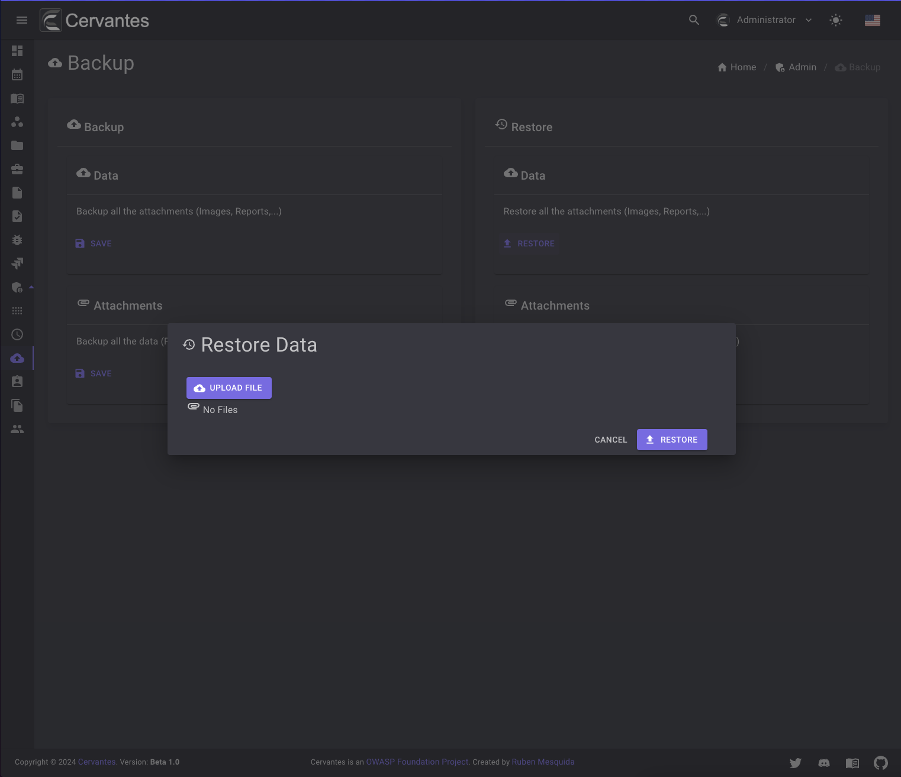
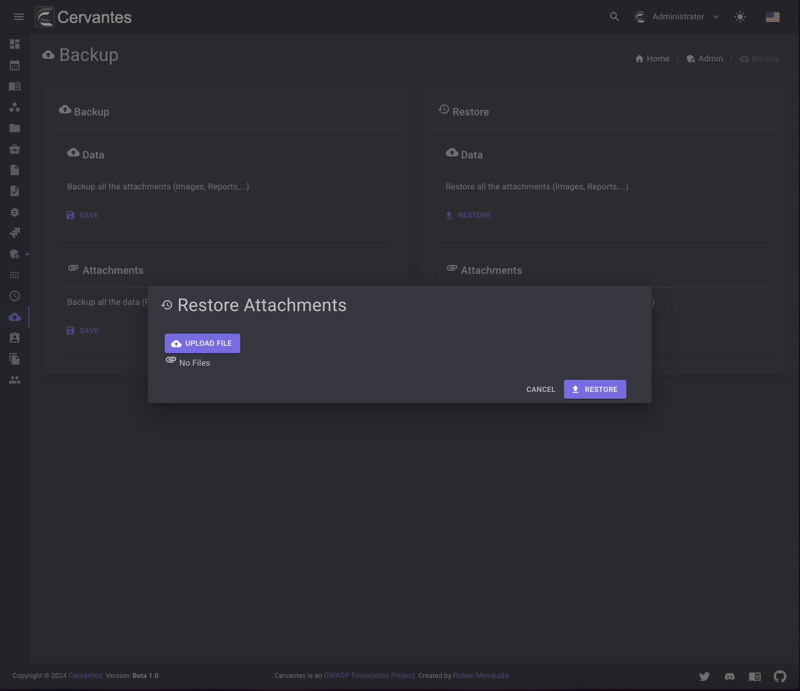

# Backup

The backup page is where you can create backups of your database and your attachments. You can only access this page if you are an Admin.

## Data

The data you can save you information from your database in json format.

<figure markdown>
  { width="800" }
  <figcaption>Backup data</figcaption>
</figure>

## Attachments

The attachments you can save you attachments from your application in zip format.

## Restore Data

To restore the data you need to select the json file generated by cervantes and click on the `Restore` button.

<figure markdown>
  { width="800" }
  <figcaption>Restore data</figcaption>
</figure>

## Restore Attachments

To restore the attachments you need to select the zip file generated by cervantes and click on the `Restore` button.

<figure markdown>
  { width="800" }
  <figcaption>Restore attachments</figcaption>
</figure>