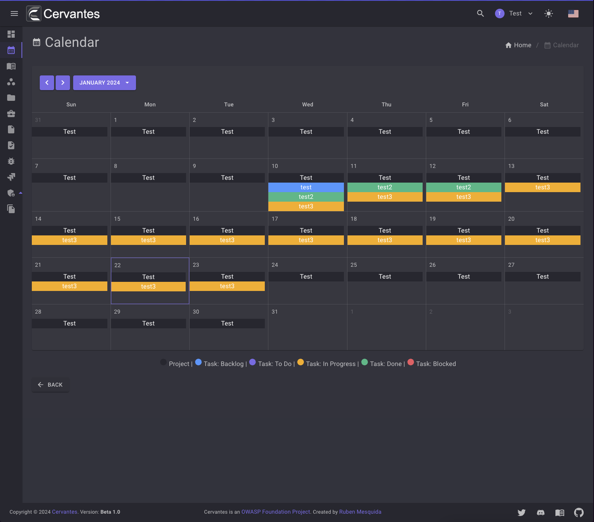

# Calendar

The calendar is a personal calendar for each user. It allows you to view your tasks and projects in a calendar view.

<figure markdown>
  { width="800" }
  <figcaption>Calendar</figcaption>
</figure>

