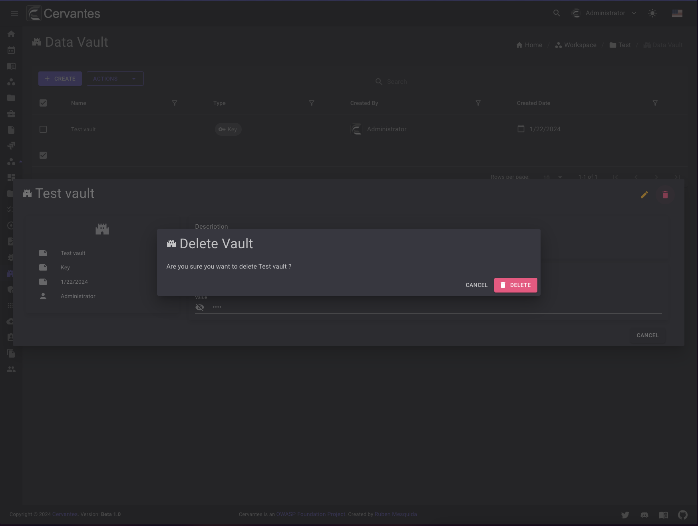

# Checklists

The checklists page let you create chcklists for the targets on your project. You can create as many checklists as you want and add as many targets as you want to each checklist.
Right now you can create OWASP WSTG & MASTG checklists.

<figure markdown>
  { width="800" }
  <figcaption>Checklists list</figcaption>
</figure>

## Create a checklist

To create a checklist you need to click on the `Create` you need to select the target and checklist type

<figure markdown>
  { width="800" }
  <figcaption>Create Checklist</figcaption>
</figure>

## Edit a checklist

To edit a checklist you need to select the checklist from the datagrid and you can start editing the checklist.

<figure markdown>
  { width="800" }
  <figcaption>Edit Checklist</figcaption>
</figure>

## Delete a checklist

To delete a checklist you need to select the checklist from the datagrid and click on the `Delete` button at the top right and confirm the action.

<figure markdown>
  { width="800" }
  <figcaption>Checklist delete</figcaption>
</figure>

Also you can delete multiple checklists at once by selecting them from the datagrid and click on the `Actions -> Delete` button at the top  confirm the action.

## Generate Report

To generate a report you need to select the checklist from the datagrid and click on the `Generate Report` button at the bottom right

<figure markdown>
  { width="800" }
  <figcaption>Checklist generate report</figcaption>
</figure>

## Download Report

To download a report you need to go to the project page and click on the `Reports` tab and select the report that you want to download and click on the `Download` button at the top right and confirm the action.

<figure markdown>
  { width="800" }
  <figcaption>Checklist download report</figcaption>
</figure>

