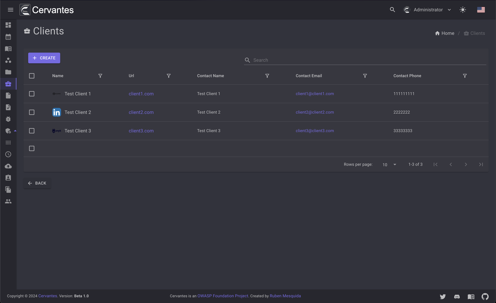
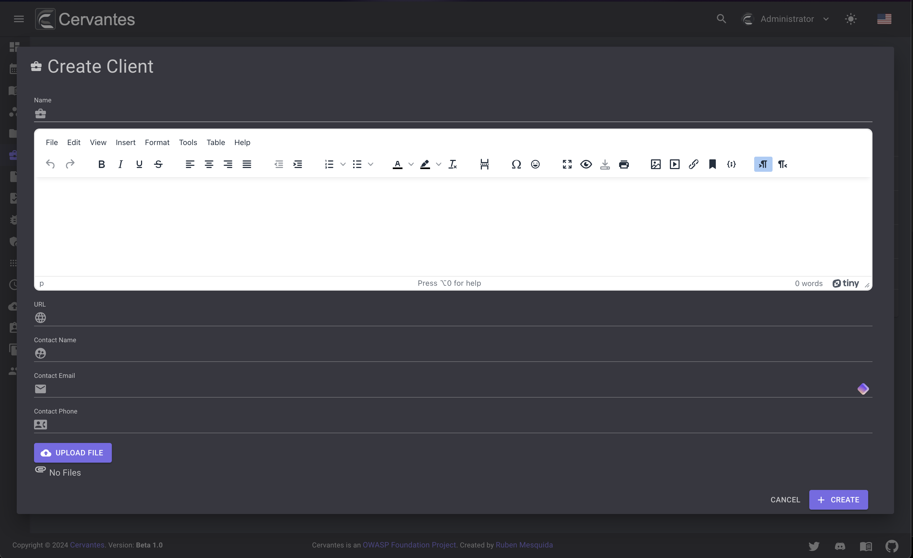
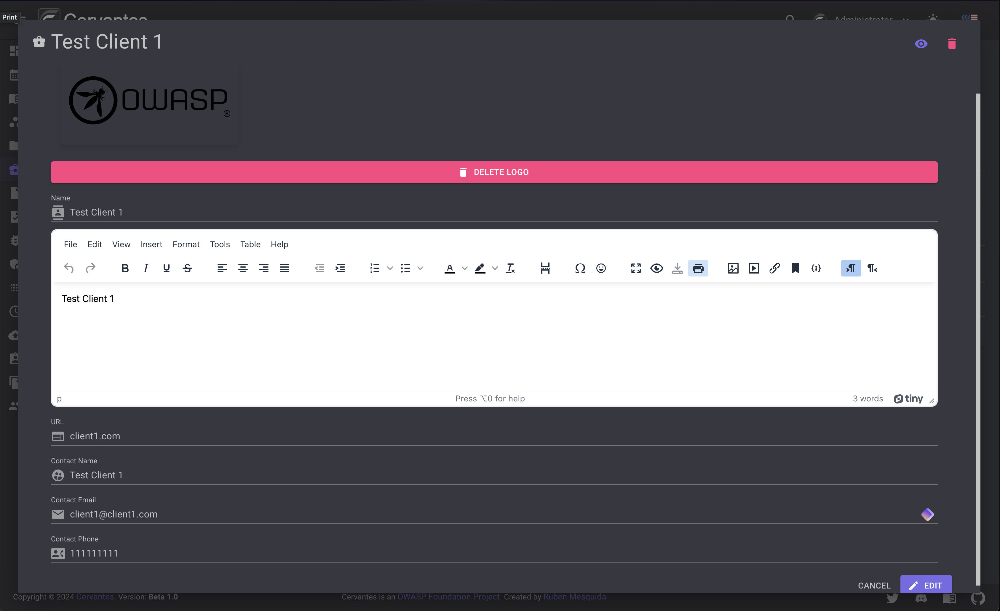
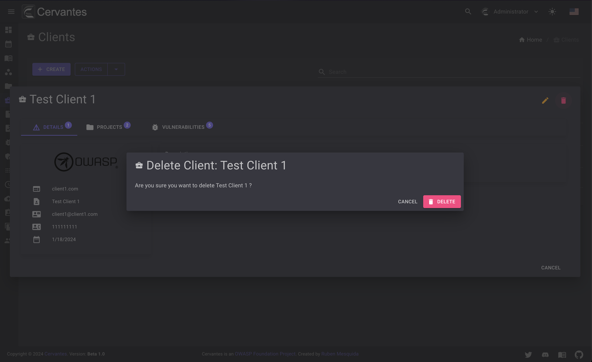
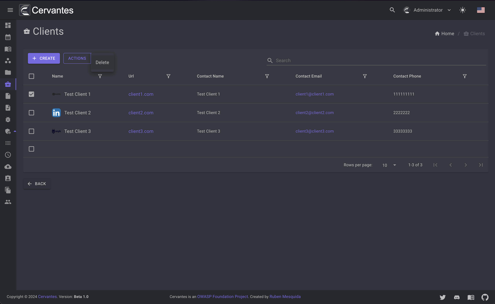
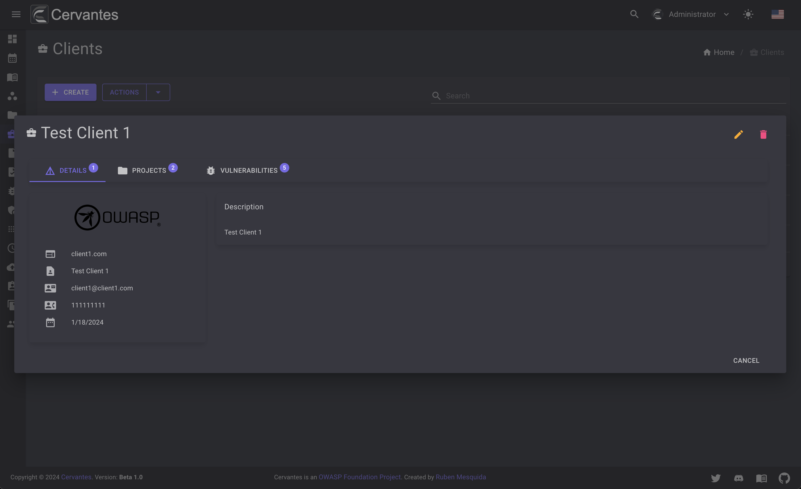
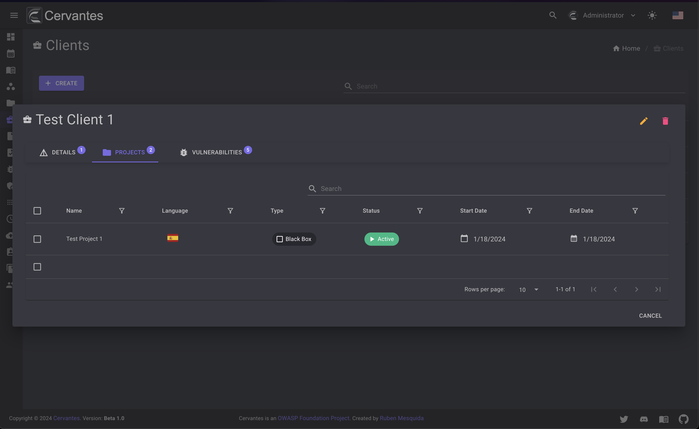
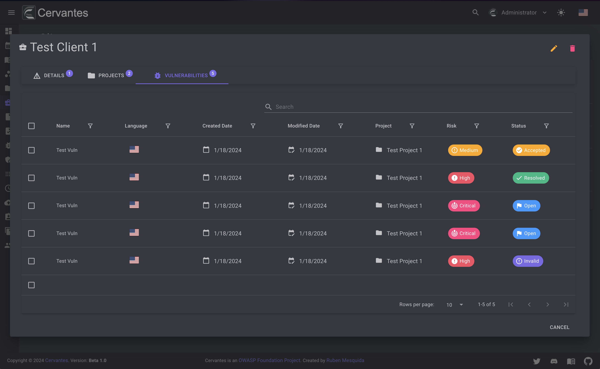

# Clients

The clients page allows you to manage your clients, create, edit, delete and view details about them.

<figure markdown>
  { width="800" }
  <figcaption>Clients list</figcaption>
</figure>

## Create a client

To create a client you need to click on the `Create` button and fill the form. 
You can upload a logo for the client and also you can add a description that will be used in the reports and other parts of the app.
Only `Admins` and `SuperUser` can create clients.

<figure markdown>
  { width="800" }
  <figcaption>Create Client</figcaption>
</figure>

## Edit a client

To edit a client you need to select the client from the datagrid and click on the `Edit` button at the top right and edit the information.
Just note that the only `Admins` and `SuperUser` can edit the client information.

<figure markdown>
  { width="800" }
  <figcaption>Edit Client</figcaption>
</figure>

## Delete a client

To delete a client you need to select the client from the datagrid and click on the `Delete` button at the top right and confirm the action.
Just note that the only `Admins` and `SuperUser` can delete clients.

<figure markdown>
  { width="800" }
  <figcaption>Client delete</figcaption>
</figure>

Also you can delete multiple clients at once by selecting them from the datagrid and click on the `Actions -> Delete` button at the top  confirm the action.

<figure markdown>
  { width="800" }
  <figcaption>Clients bulk delete</figcaption>
</figure>

## Client details

To access the client details you need to select the client from the datagrid. 
On the client details page you can see the client information, projects, vulnerabilities and also you can edit the client information.

<figure markdown>
  { width="800" }
  <figcaption>Client details</figcaption>
</figure>

<figure markdown>
  { width="800" }
  <figcaption>Client projects</figcaption>
</figure>

<figure markdown>
  { width="800" }
  <figcaption>Client vulnerabilities</figcaption>
</figure>