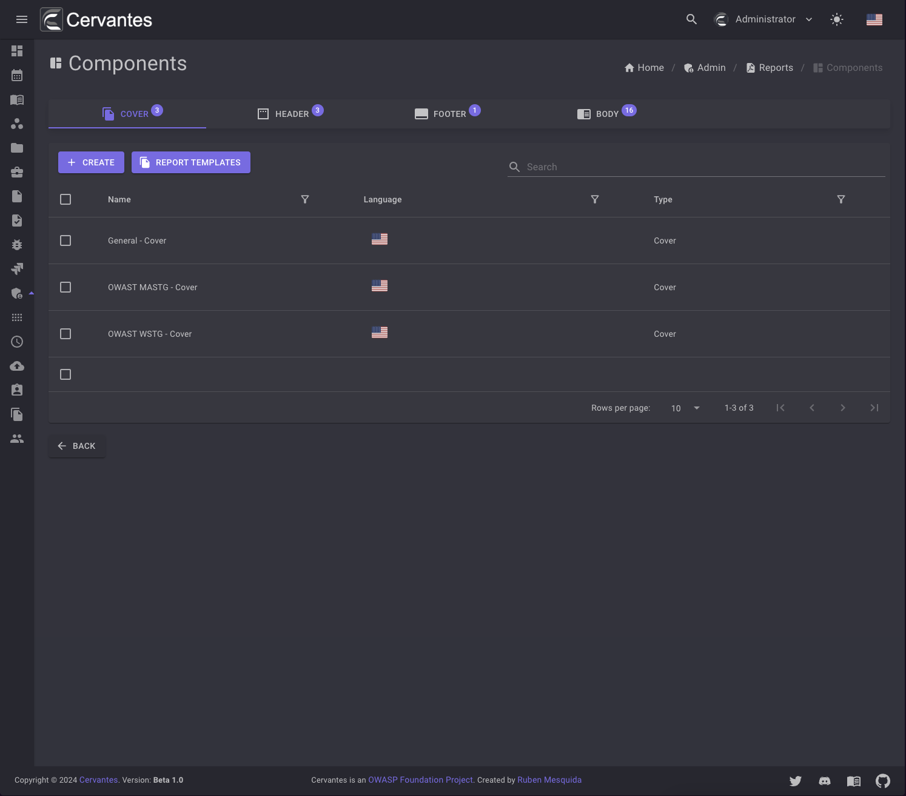
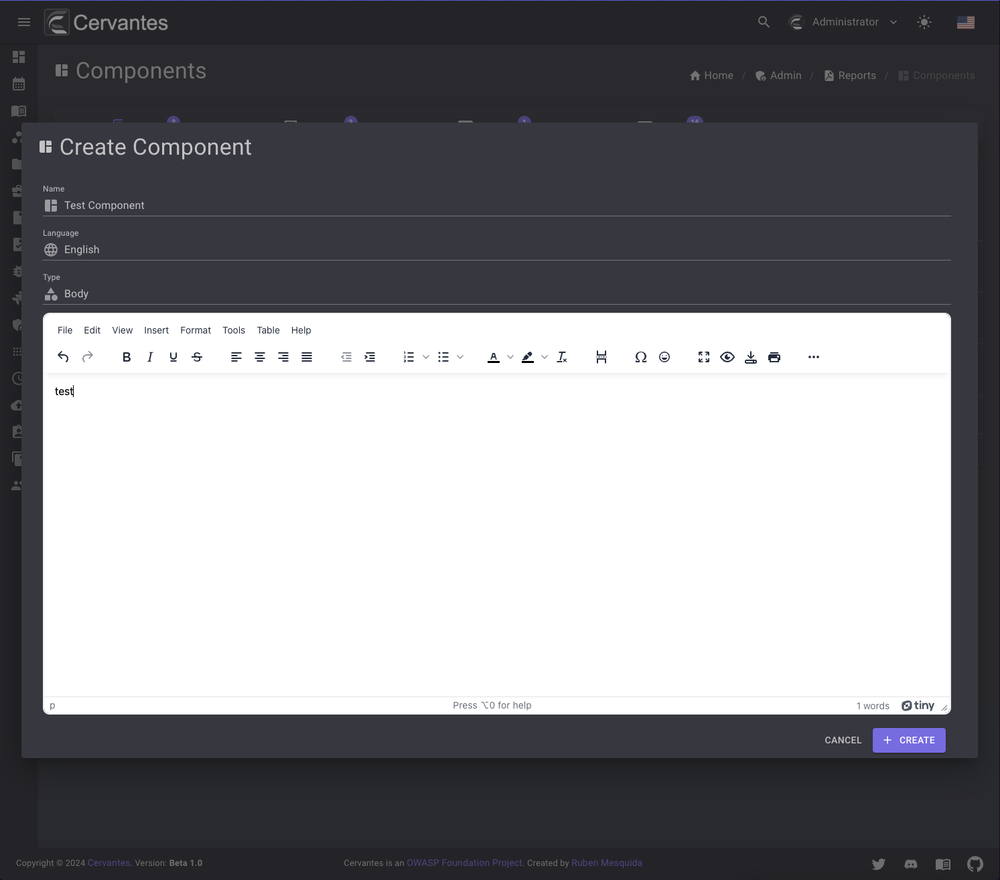
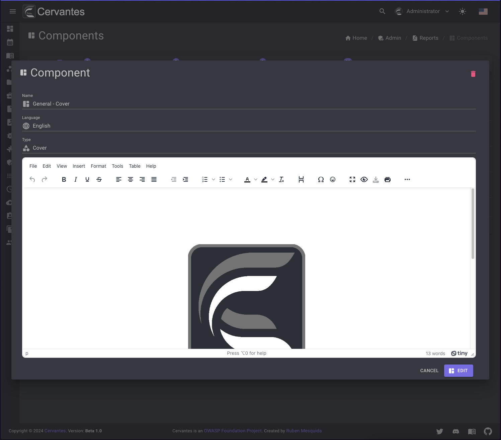
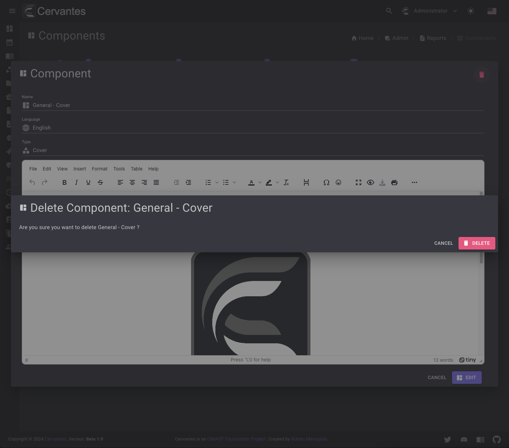
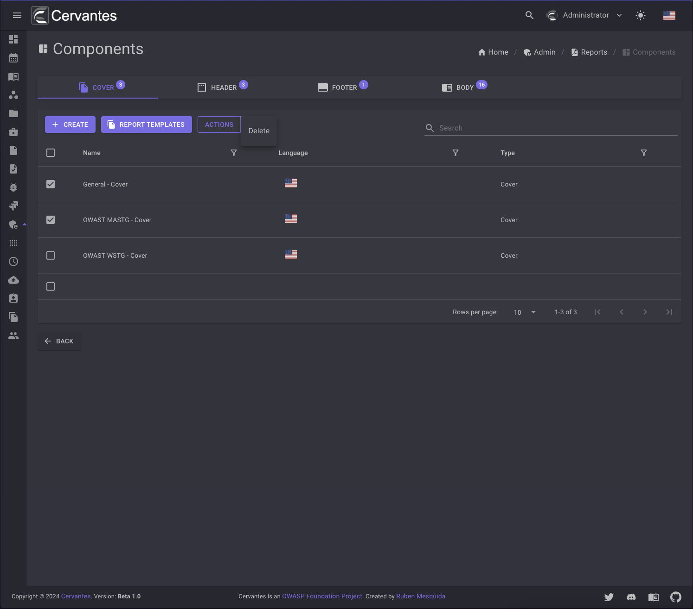

# Report Components

The report components are the building blocks of a report. They are the elements that are used to display the data in the report. 
The report components are divided into four categories: **Cover**, **Header**, **Footer** and **Body** depending on where they are displayed in the report.

About the available variables you can use in the components, please refer to the [Reference](../reference/index.md) section.

<figure markdown>
  { width="800" }
  <figcaption>Components list</figcaption>
</figure>

## Create a component

To create a component you need to click on the `Create` button and fill the form and select the Component type that you want to create and language.

<figure markdown>
  { width="800" }
  <figcaption>Create Component</figcaption>
</figure>

## Edit a component

To edit a component you need to select the component from the datagrid and a new dialog will open with the component information.

<figure markdown>
  { width="800" }
  <figcaption>Edit Component</figcaption>
</figure>

## Delete a component

To delete a component you need to select the component from the datagrid and click on the `Delete` button at the top right and confirm the action.

<figure markdown>
  { width="800" }
  <figcaption>Component delete</figcaption>
</figure>

Also you can delete multiple components at once by selecting them from the datagrid and click on the `Actions -> Delete` button at the top  confirm the action.

<figure markdown>
  { width="800" }
  <figcaption>Bulk Component delete</figcaption>
</figure>

