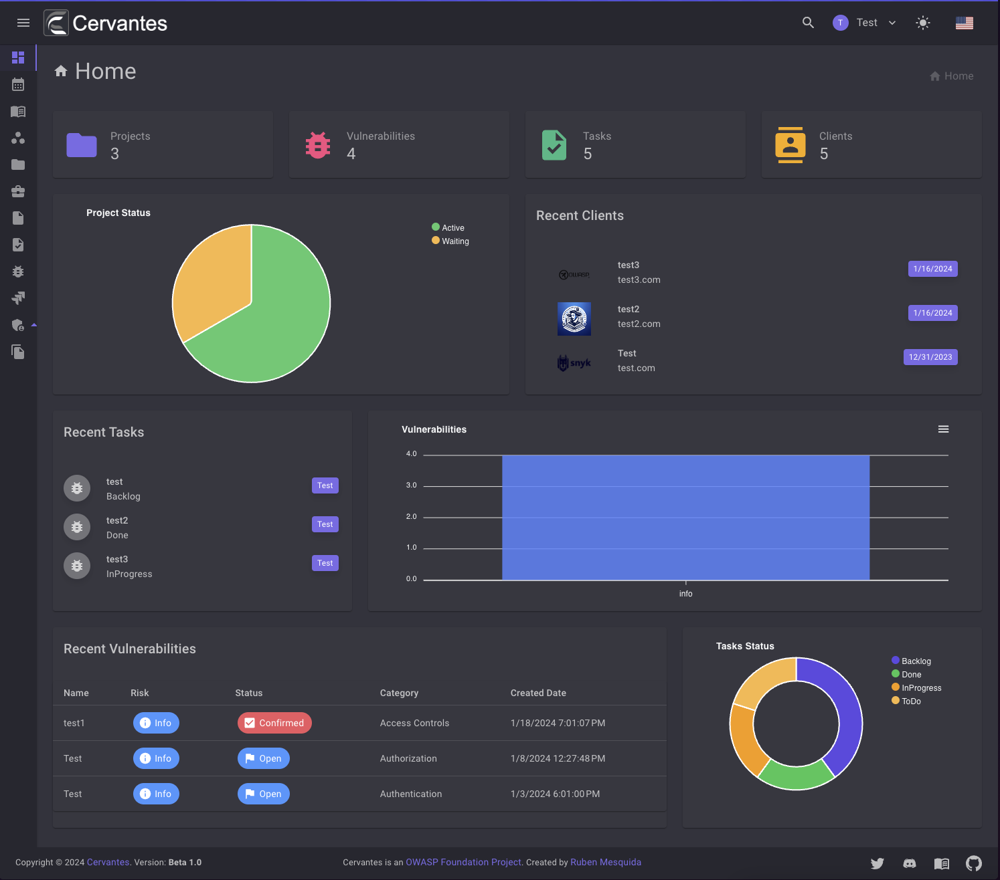

# Dashboard

The dashboard is the first page you see when you log in Cervnates. It gives you a quick overview of the current state of your Projects, Clients, Tasks and more.

<figure markdown>
  { width="800" }
  <figcaption>Dashboard</figcaption>
</figure>

