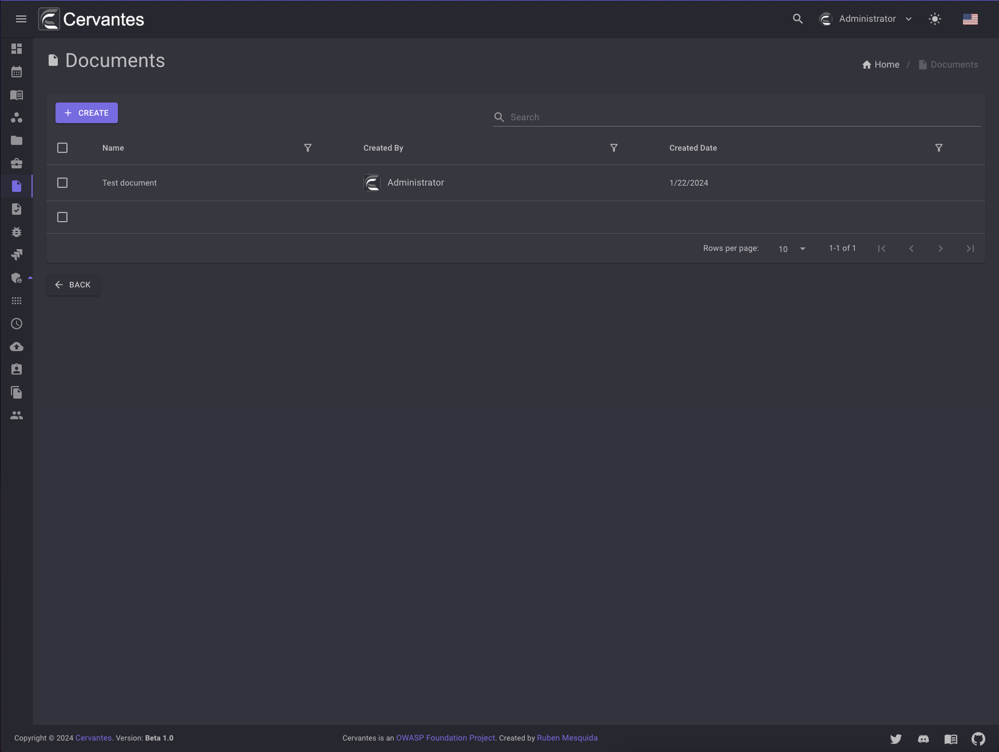
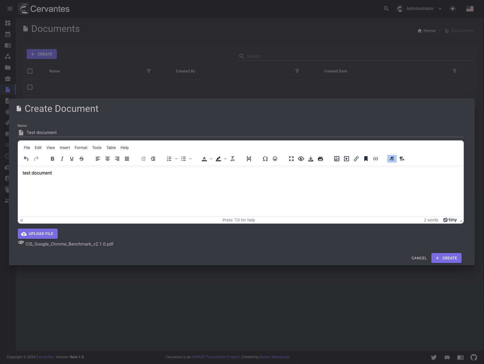
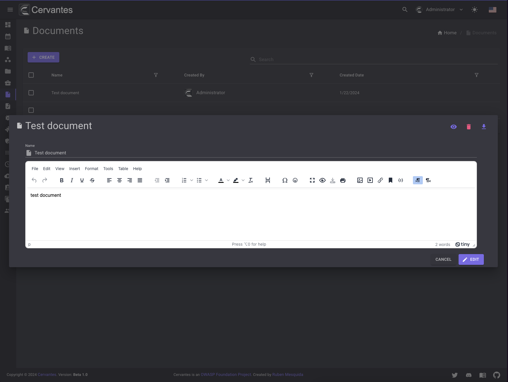
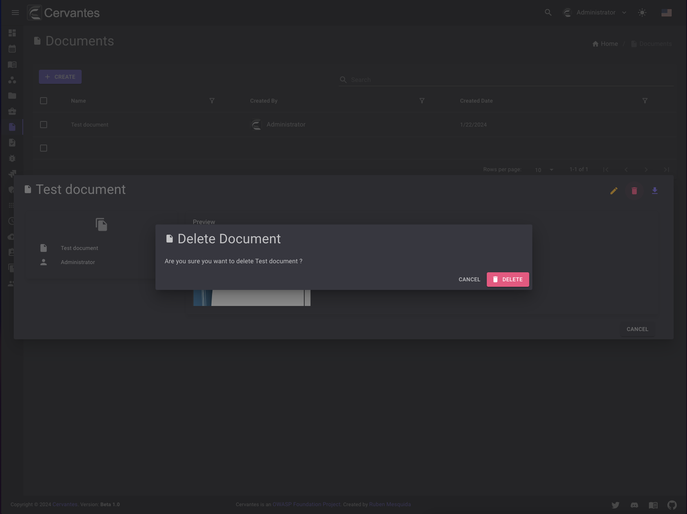
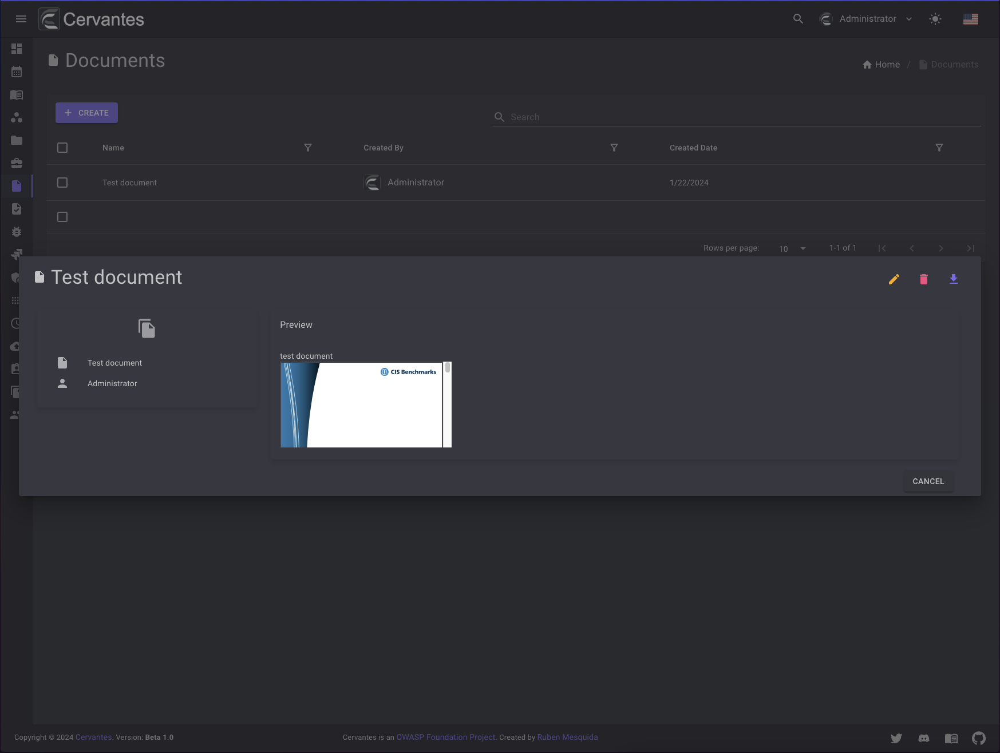

# Documents

The documents page allows you to manage and upload your documents. You can upload templates, checklists and more

<figure markdown>
  { width="800" }
  <figcaption>Documents list</figcaption>
</figure>

## Create a document

To create a document you need to click on the `Create` button and fill the form and select the file that you want to upload.

<figure markdown>
  { width="800" }
  <figcaption>Create Document</figcaption>
</figure>

## Edit a document

To edit a document you need to select the document from the datagrid and click on the `Edit` button at the top right and edit the information.
You can edit teh name and description of the document.

<figure markdown>
  { width="800" }
  <figcaption>Edit Document</figcaption>
</figure>

## Delete a document

To delete a document you need to select the document from the datagrid and click on the `Delete` button at the top right and confirm the action.

<figure markdown>
  { width="800" }
  <figcaption>Document delete</figcaption>
</figure>

Also you can delete multiple documents at once by selecting them from the datagrid and click on the `Actions -> Delete` button at the top  confirm the action.

## Download a document

To download a document you need to select the document from the datagrid and click on the `Download` button at the top right and confirm the action.

<figure markdown>
  { width="800" }
  <figcaption>Document download</figcaption>
</figure>