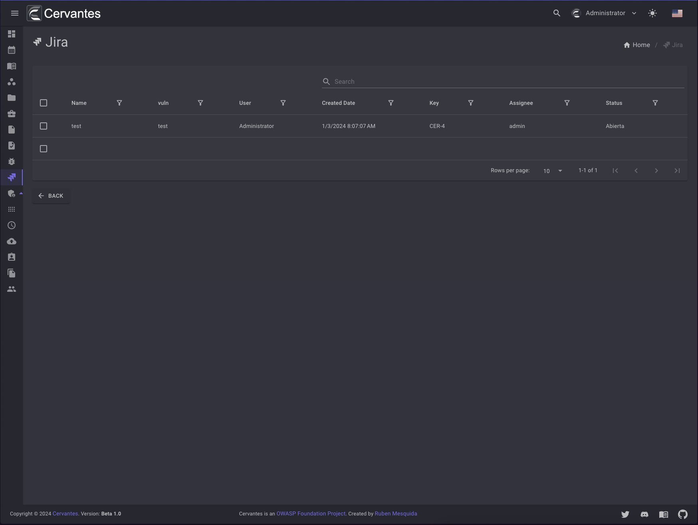
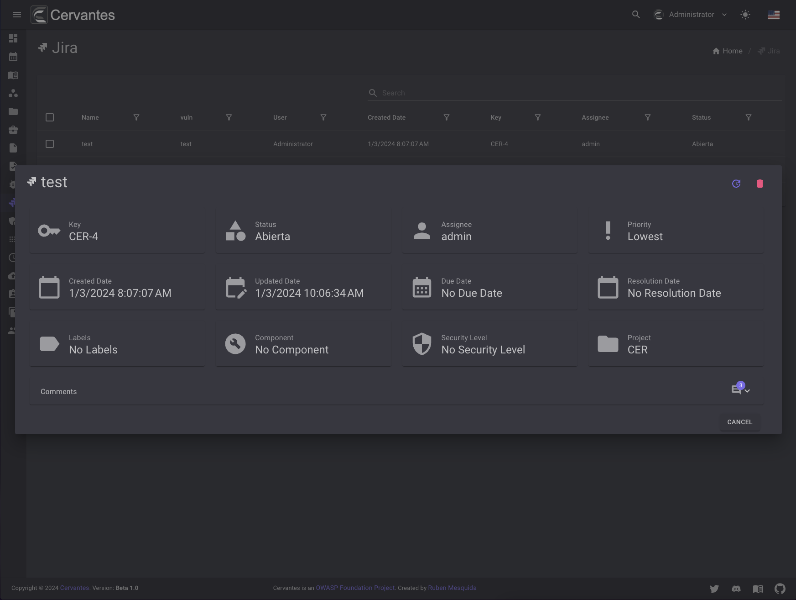
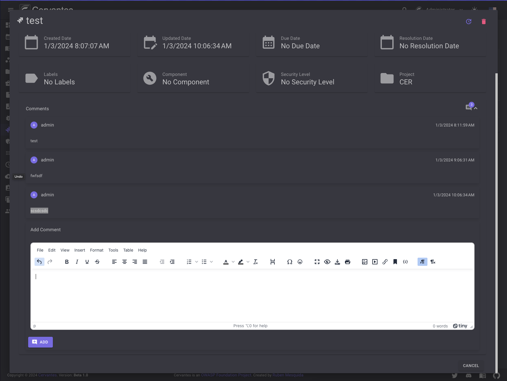
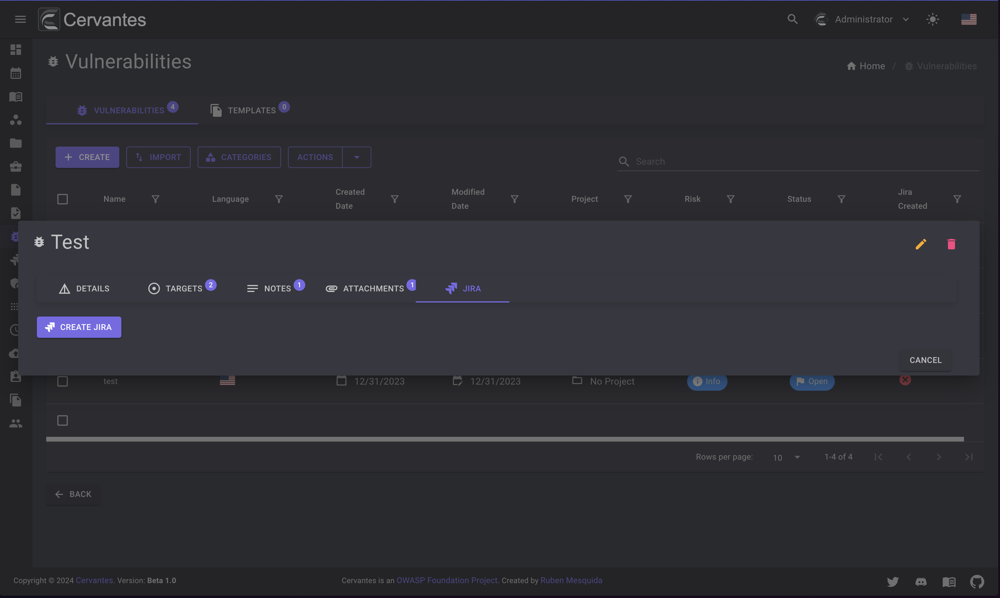

# Jira

The Jira page allows you to manage your opened tickets in Jira from the Vulnerabilities.

<figure markdown>
  { width="800" }
  <figcaption>Jira list</figcaption>
</figure>

To access the Jira page you need to click on the `Jira` button on the left sidebar.

<figure markdown>
  { width="800" }
  <figcaption>Jira button</figcaption>
</figure>

## Add comment

To add a comment to a Jira ticket you need to click on the `Add Comment` con the comments section

<figure markdown>
  { width="800" }
  <figcaption>Add comment</figcaption>
</figure>

## Create

To create a Jira ticket you need to click on the `Create` onm the jira tab in Vulnerability Dialog

<figure markdown>
  { width="800" }
  <figcaption>Create Jira</figcaption>
</figure>

## Delete

To delete a Jira ticket you need to click on the `Delete` on Delete icon at the top right of the Jira Dialog

<figure markdown>
  { width="800" }
  <figcaption>Delete Jira</figcaption>
</figure>