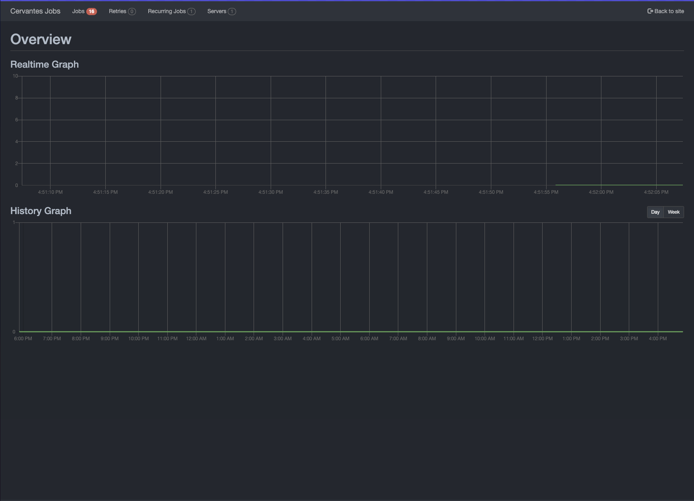
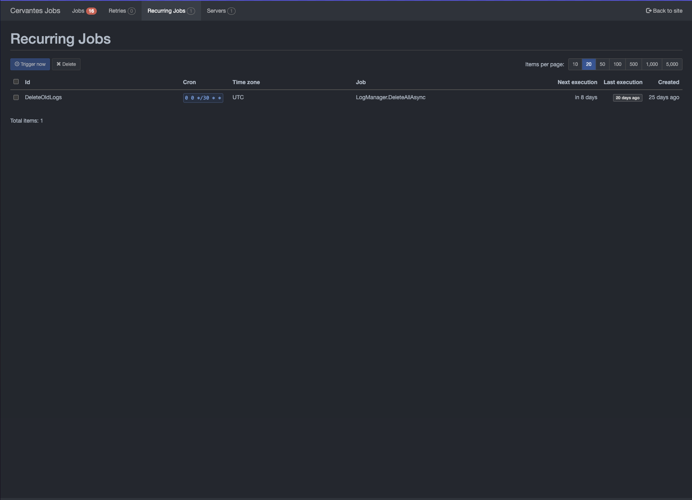

# Jobs

Cervantes uses background jobs to perform tasks that are not related to the user's request. For example, sending emails, generating reports, and more.
You can check the status of the jobs in the `Jobs` page. You can only access this page if you are an Admin.

<figure markdown>
  { width="800" }
  <figcaption>Jobs</figcaption>
</figure>

<figure markdown>
  { width="800" }
  <figcaption>Jobs</figcaption>
</figure>