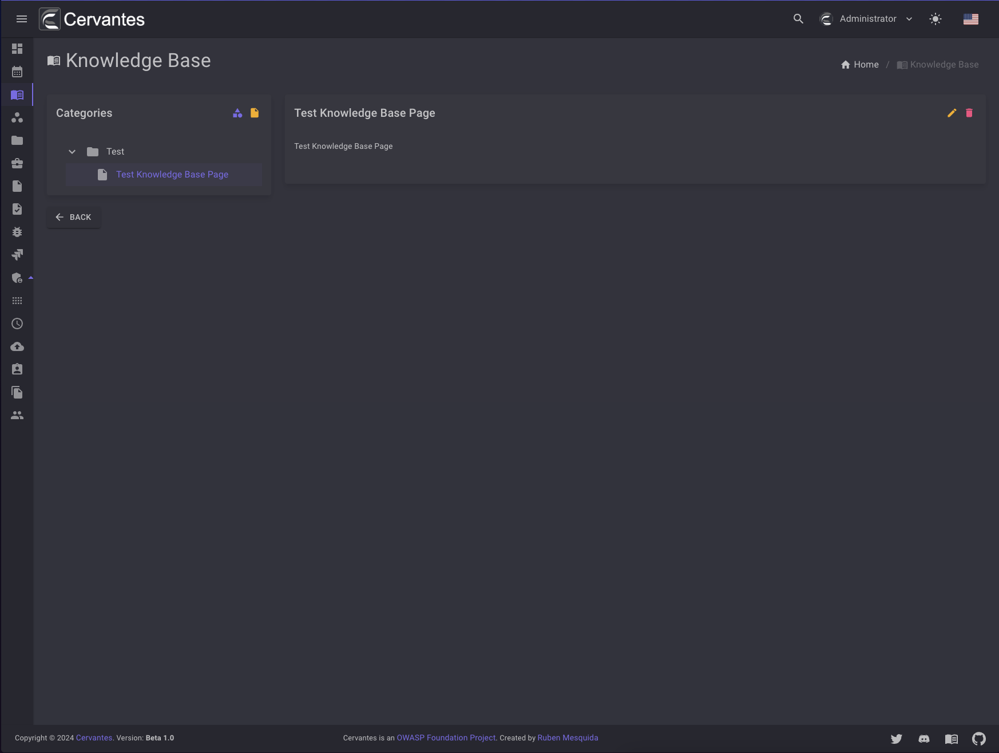
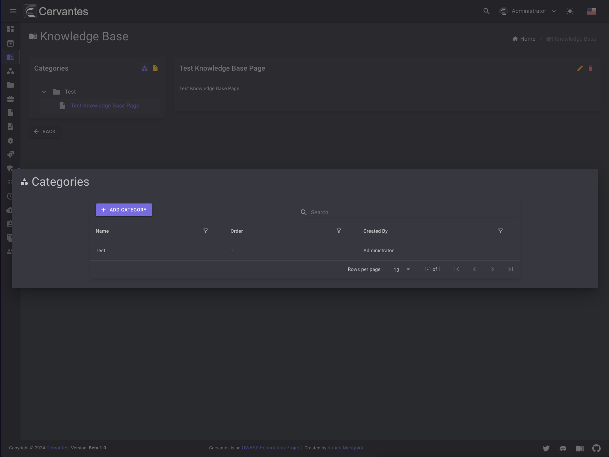
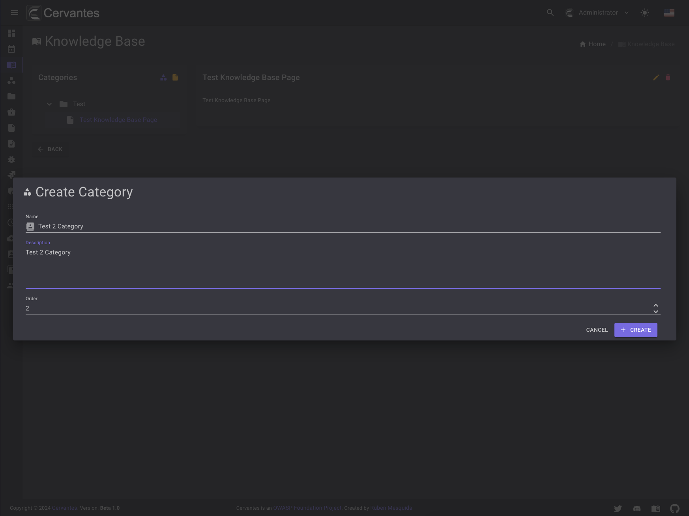
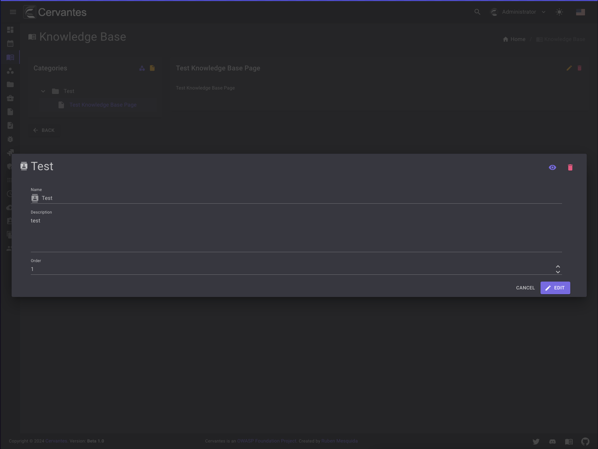
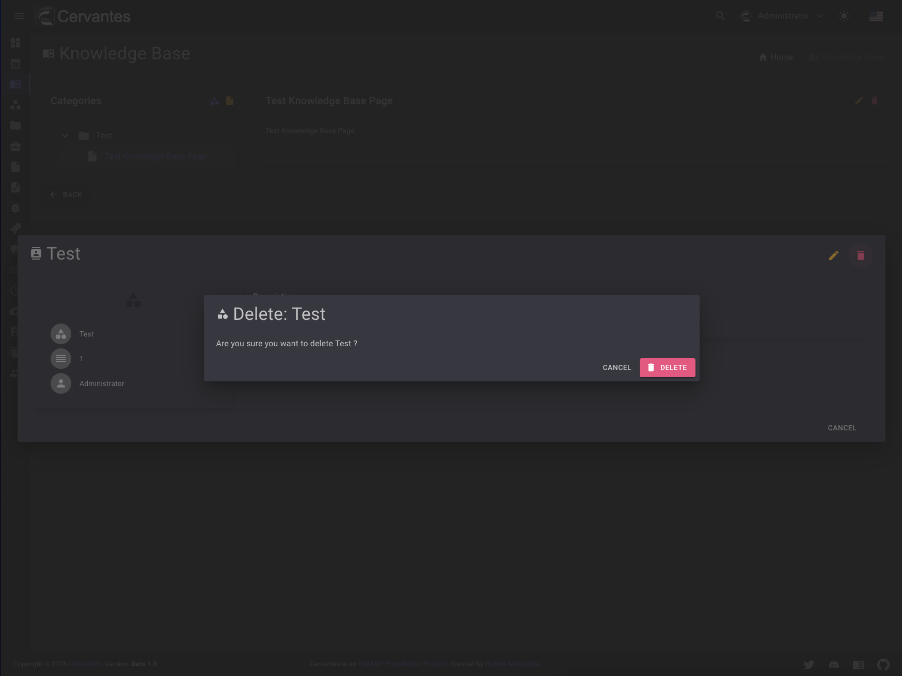
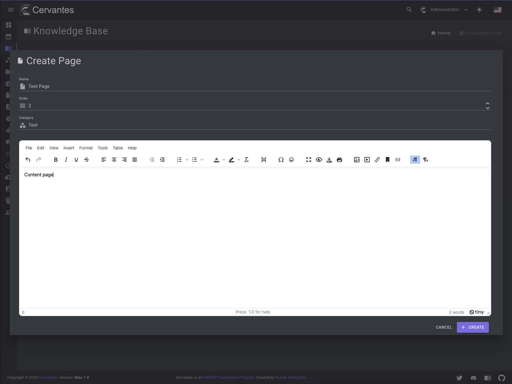
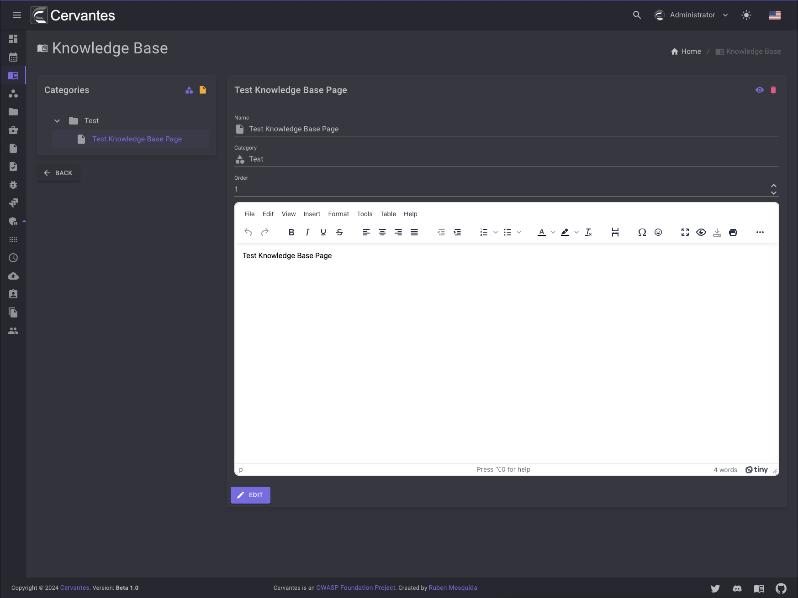
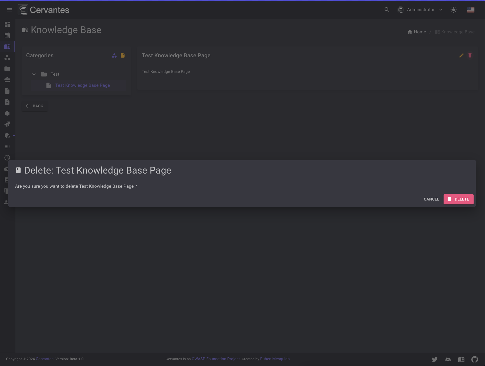

# Knowledge Base

In the knowledge base you can collaborate with your colleagues to create a shared repository of knowledge.
You can create pages, organize them in categories to make them easier to find.

<figure markdown>
  { width="800" }
  <figcaption>Knowledge Base</figcaption>
</figure>

## Creating a category

To create a category, click on the `shape` purple button in the sidebar and click on `Add category`.

<figure markdown>
  { width="800" }
  <figcaption>Categories</figcaption>
</figure>

<figure markdown>
  { width="800" }
  <figcaption>Add category</figcaption>
</figure>

## Editing a category

To edit a category you need to select it from the datagrid and click on the `Edit` button at the top right and edit the information.

<figure markdown>
  { width="800" }
  <figcaption>Edit category</figcaption>
</figure>

## Deleting a category

To delete a category you need to select it from the datagrid and click on the `Delete` button at the top right and confirm the delete action.

<figure markdown>
  { width="800" }
  <figcaption>Delete category</figcaption>
</figure>

## Creating a page

To create a page, click on the `page` yellow button in the sidebar and a new dialog will open.
You need to select the category where you want to create the page and click on the `Create` button.

<figure markdown>
  { width="800" }
  <figcaption>Add page</figcaption>
</figure>

## Editing a page

To edit a page you need to select it from the sidebar and click on the `Edit` button at the top right and edit the information.

<figure markdown>
  { width="800" }
  <figcaption>Edit page</figcaption>
</figure>

## Deleting a page

To delete a page you need to select it from the sidebar and click on the `Delete` button at the top right and confirm the delete action.

<figure markdown>
  { width="800" }
  <figcaption>Delete page</figcaption>
</figure>