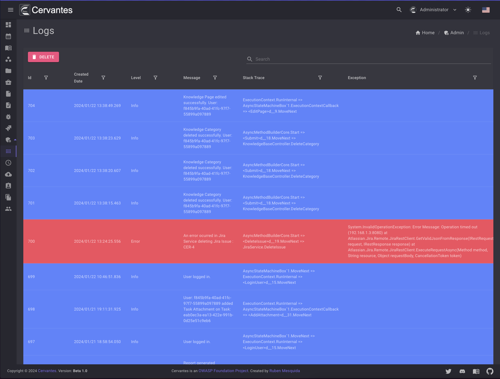

# Logs

The logs page is where you can view all the logs of your application. You can filter the logs by level, message, and more.
You can only access this page if you are an Admin.

Also you can delete all the logs by clicking on the `Delete` button.

<figure markdown>
  { width="800" }
  <figcaption>Logs</figcaption>
</figure>

## Archiving Time

By default Cervantes saves the logs for 30 days, but you can change this value by setting the `TimeArchive` option. You can change this value in the `appsettings.json` file using a cron expression.

`"TimeArchive" : "0 0 */30 * *"`

```json
"Logging": {
"TimeArchive" : "0 0 */30 * *",
"LogLevel": {
"Default": "Trace",
"Microsoft": "Warning",
"Microsoft.Hosting.Lifetime": "Information",
"Cervantes.*": "Trace"
}
}
```