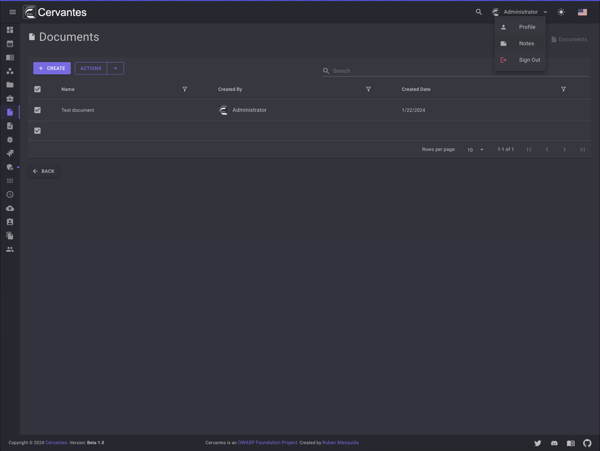
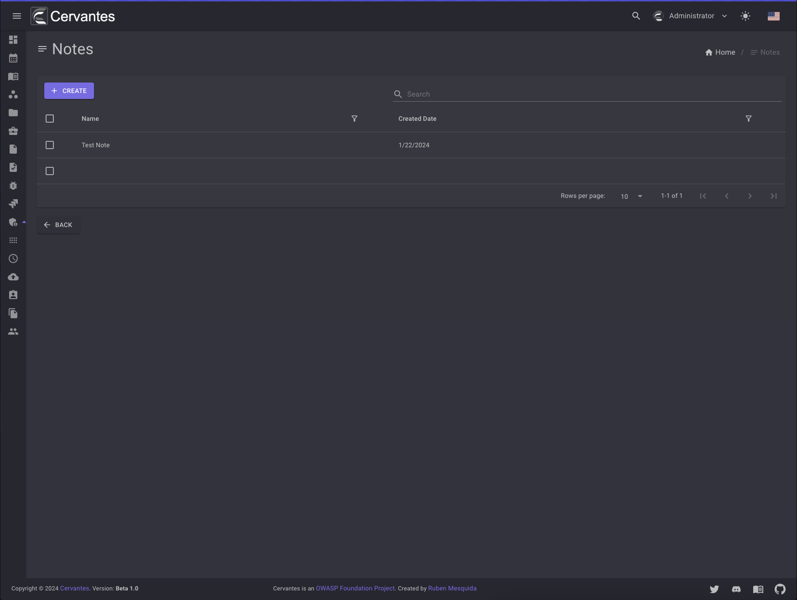
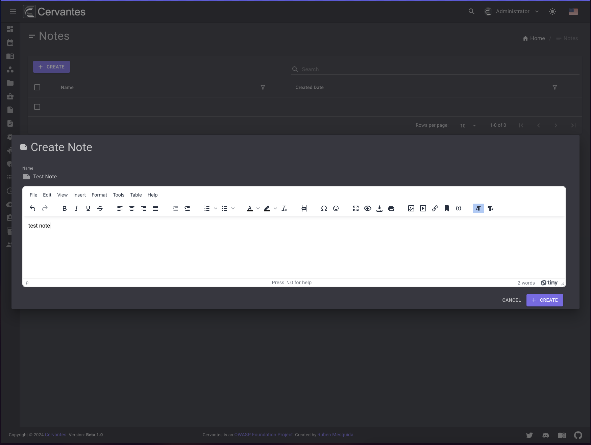
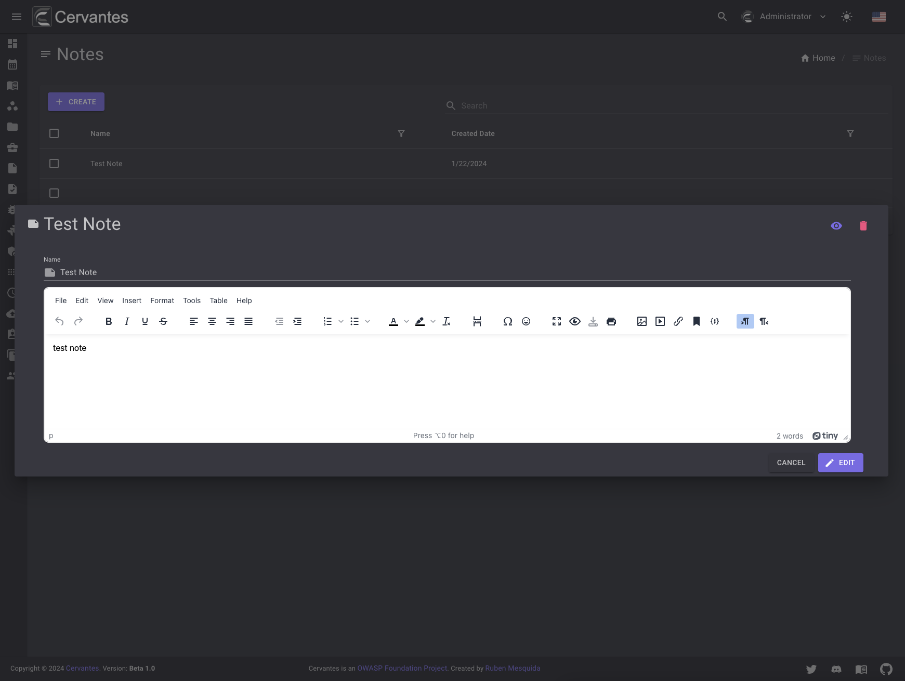
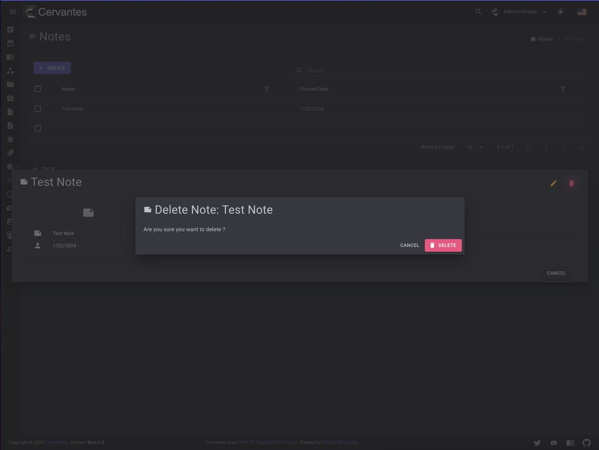

# Notes

The notes page allows you to create and take your own notes. You can access from your profile menu at `Notes` option.

<figure markdown>
  { width="800" }
  <figcaption>Notes access</figcaption>
</figure>

<figure markdown>
  { width="800" }
  <figcaption>Notes list</figcaption>
</figure>

## Create a note

To create a note you need to click on the `Create` button and fill the form.

<figure markdown>
  { width="800" }
  <figcaption>Create Note</figcaption>
</figure>

## Edit a note

To edit a note you need to select the note from the datagrid and click on the `Edit` button at the top right and edit the information.

<figure markdown>
  { width="800" }
  <figcaption>Edit Note</figcaption>
</figure>

## Delete a note

To delete a note you need to select the note from the datagrid and click on the `Delete` button at the top right and confirm the action.

<figure markdown>
  { width="800" }
  <figcaption>Note delete</figcaption>
</figure>