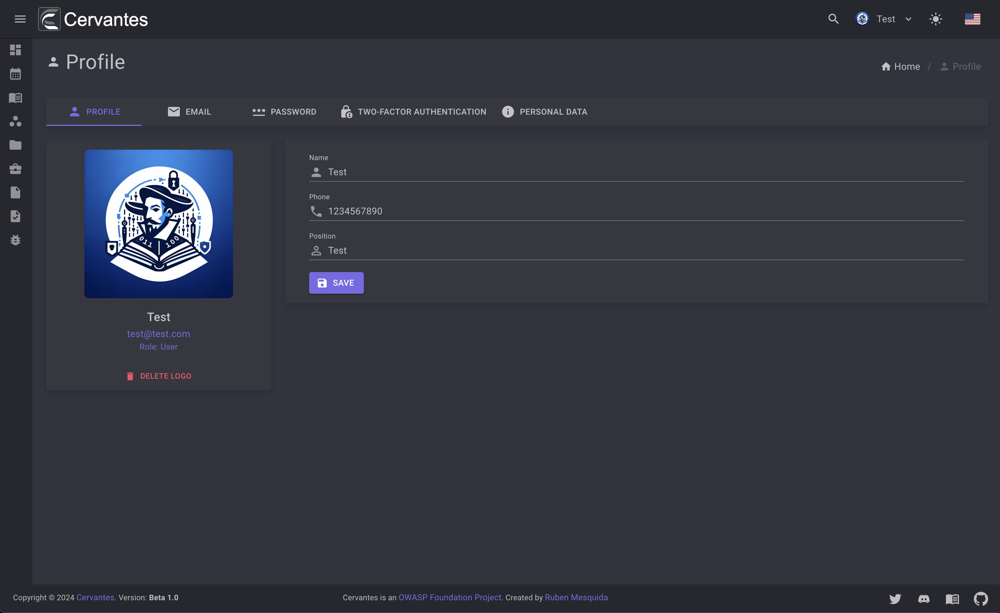
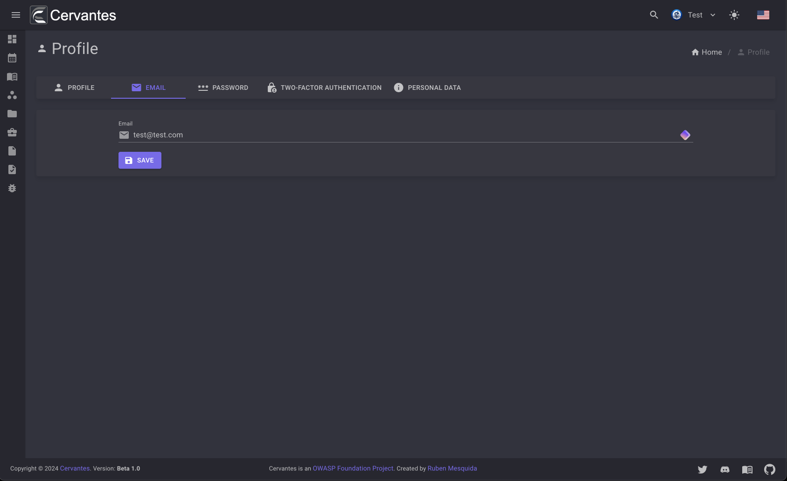
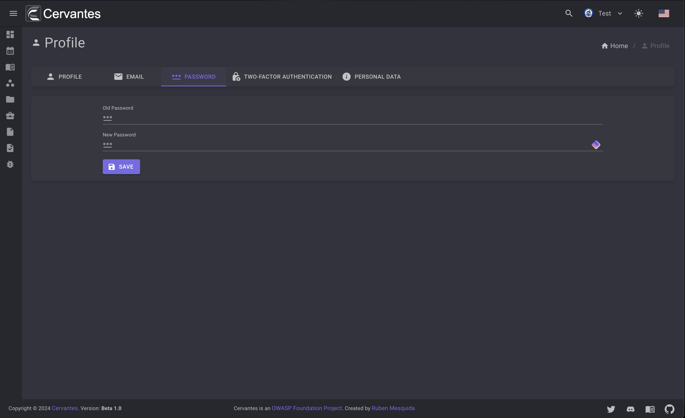
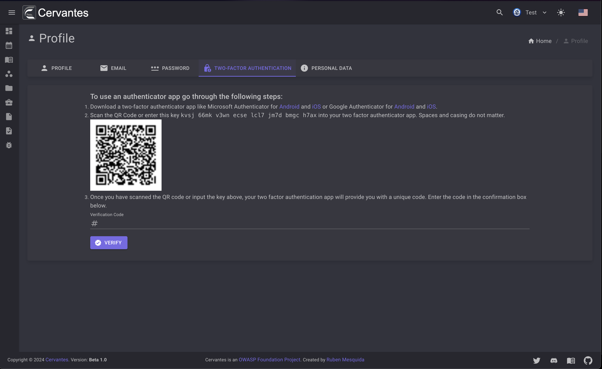
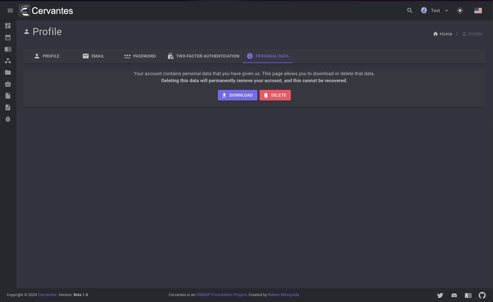

# Profile

The profile page allows you to manage your personal information, change your password, change your email and manage your 2FA settings.

## Profile

The personal information section allows you to change your name, phone, position and also you can change your profile picture.

<figure markdown>
  { width="800" }
  <figcaption>Profile Data</figcaption>
</figure>

## Email

The change email section allows you to change your email.

<figure markdown>
  { width="800" }
  <figcaption>Change Email</figcaption>
</figure>

## Change Password

The change password section allows you to change your password.

<figure markdown>
  { width="800" }
  <figcaption>Change password</figcaption>
</figure>

## 2FA

The 2FA section allows you to manage your 2FA settings.
<figure markdown>
  { width="800" }
  <figcaption>Manage 2FA</figcaption>
</figure>

## Personal Data

The personal data section allows you to download your personal data and also delete your account.

<figure markdown>
  { width="800" }
  <figcaption>Personal Data</figcaption>
</figure>