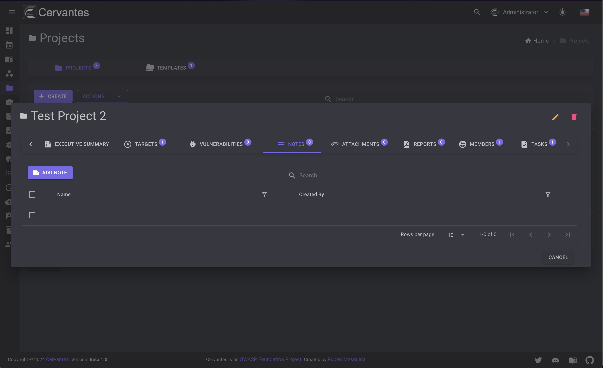
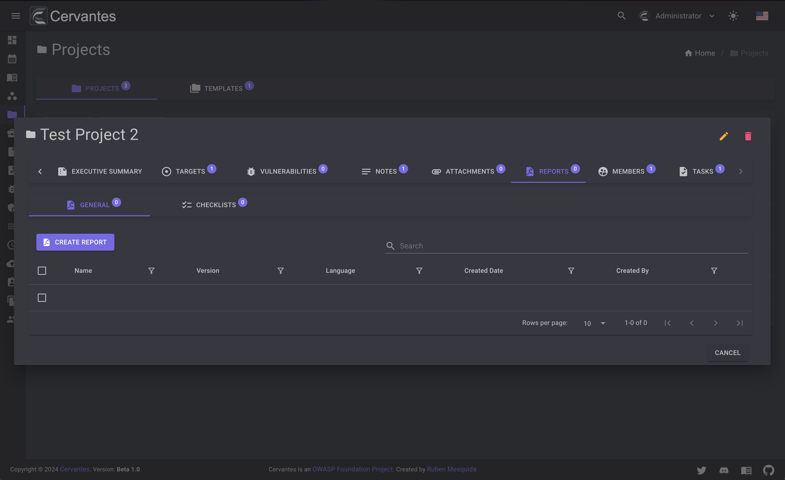

# Projects

The projects page allows you to manage your projects, create, edit, delete and more.

<figure markdown>
  { width="800" }
  <figcaption>Projects list</figcaption>
</figure>

## Templates

On the templates tab you can manage your project templates. These templates can be used to create projects with predefined settings and save time when creating projects.

<figure markdown>
  { width="800" }
  <figcaption>Project Templates</figcaption>
</figure>

## Create a project

To create a project you need to click on the `Create` button and fill the form.
You can select the client that the project belongs to and also you can add a description that will be used in the reports and other parts of the app.
Just note that the only `Admins` and `SuperUser` can create projects.

You can create a project from a template by selecting the template from the dropdown at top right.

<figure markdown>
  { width="800" }
  <figcaption>Create Project</figcaption>
</figure>

## Edit a project

To edit a project you need to select the project from the datagrid and click on the `Edit` button at the top right and edit the information. Just note that the only `Admins` and `SuperUser` can edit projects.

<figure markdown>
  { width="800" }
  <figcaption>Edit Project</figcaption>
</figure>

## Delete a project

To delete a project you need to select the project from the datagrid and click on the `Delete` button at the top right and confirm the action. Just note that the only `Admins` and `SuperUser` can delete projects.

<figure markdown>
  { width="800" }
  <figcaption>Project delete</figcaption>
</figure>

Also you can delete multiple projects at once by selecting them from the datagrid and click on the `Actions -> Delete` button at the top  confirm the action.

<figure markdown>
  { width="800" }
  <figcaption>Projects bulk delete</figcaption>
</figure>

## Project details

To access the project details you need to select the project from the datagrid. On the project details page you can see the project information, members, vulnerabilities etc.

<figure markdown>
  { width="800" }
  <figcaption>Project details</figcaption>
</figure>

### Members

Before to start working with the projects you need to add members to the project.
If the member is not in the project it will not have access to interact with the project and will not have access to the project workspace.

To add members to the project you need to click on the `Members` tab and click on the `Add` button and select the members that you want to add to the project. Only the `Admins` and `SuperUser` can add members to the project.

<figure markdown>
  { width="800" }
  <figcaption>Project members</figcaption>
</figure>

If you want to remove a member from the project you need to select the user that you want to remove  and confirm the action.

<figure markdown>
  { width="800" }
  <figcaption>Project members delete</figcaption>
</figure>

### Executive Summary

The executive summary is a part of the report that contains the most important information and a summary for non-technical people. You can edit the executive summary by clicking on the `Executive Summary` tab and edit or add information.

<figure markdown>
  { width="800" }
  <figcaption>Project executive summary</figcaption>
</figure>

### Targets

The targets tab contains the targets that will be in the scope of the project. You can add targets by clicking on the `Add` button and fill the form. You can add multiple targets at once by clicking on the `Import` button and add the targets from a CSV or Nmap Scan.
This part will be explained in more detail in the [Targets](targets.md) section.

<figure markdown>
  { width="800" }
  <figcaption>Project targets</figcaption>
</figure>

### Vulnerabilities

The vulnerabilities tab contains the vulnerabilities that were found during the project. You can see the vulnerabilities by clicking on the `Vulnerabilities` tab.
This part will be explained in more detail in the [Vulnerabilities](vulns.md) section.

<figure markdown>
  { width="800" }
  <figcaption>Project vulnerabilities</figcaption>
</figure>

### Notes

The notes tab contains the notes that were added during the project. You can see the notes by clicking on the `Notes` tab.

<figure markdown>
  { width="800" }
  <figcaption>Project notes</figcaption>
</figure>

To add a note you need to click on the `Add` button and fill the form.

<figure markdown>
  { width="800" }
  <figcaption>Project add note</figcaption>
</figure>

To edit a note you need to select the note from the datagrid and click on the `Edit` button at the top right and edit the information.

<figure markdown>
  { width="800" }
  <figcaption>Project edit note</figcaption>
</figure>

To delete a note you need to select the note from the datagrid and click on the `Delete` button at the top right and confirm the action.

<figure markdown>
  { width="800" }
  <figcaption>Project delete note</figcaption>
</figure>

Also you can delete multiple notes at once by selecting them from the datagrid and click on the `Actions -> Delete` button at the top  confirm the action.

<figure markdown>
  { width="800" }
  <figcaption>Project bulk delete notes</figcaption>
</figure>

### Attachments

The attachments tab contains the attachments that were added during the project. You can see the attachments by clicking on the `Attachments` tab.

<figure markdown>
  { width="800" }
  <figcaption>Project attachments</figcaption>
</figure>

To add an attachment you need to click on the `Add` button and fill the form.

<figure markdown>
  { width="800" }
  <figcaption>Project add attachment</figcaption>
</figure>

To download an attachment you need to select the attachment from the datagrid and click on the `Download` button at the top right and edit the information.

To delete an attachment you need to select the attachment from the datagrid and click on the `Delete` button at the top right and confirm the action.

<figure markdown>
  { width="800" }
  <figcaption>Project delete attachment</figcaption>
</figure>

Also you can delete multiple attachments at once by selecting them from the datagrid and click on the `Actions -> Delete` button at the top  confirm the action.

<figure markdown>
  { width="800" }
  <figcaption>Project bulk delete attachments</figcaption>
</figure>

### Tasks

The tasks tab contains the tasks that were added during the project. You can see the tasks by clicking on the `Tasks` tab.
This part will be explained in more detail in the [Tasks](tasks.md) section.

<figure markdown>
  { width="800" }
  <figcaption>Project tasks</figcaption>
</figure>

### Reports

The reports tab contains the reports that were generated. You can see the reports by clicking on the `Reports` tab.
Just note that the only `Admins` and `SuperUser` can create or delete reports.

This tab contains the general reports and checklists that were generated during the project.

<figure markdown>
  { width="800" }
  <figcaption>Reports Lists</figcaption>
</figure>

You can create a report by clicking on the `Create` button and fill the form and select teh template you want to use.

<figure markdown>
  { width="800" }
  <figcaption>Create Report</figcaption>
</figure>

<figure markdown>
  { width="800" }
  <figcaption>Report</figcaption>
</figure>

To edit a report you need to select the report from the datagrid and click on the `Edit` button at the top right and edit the information.

<figure markdown>
  { width="800" }
  <figcaption>Edit Report</figcaption>
</figure>

To delete a report you need to select the report from the datagrid and click on the `Delete` button at the top right and confirm the action.

<figure markdown>
  { width="800" }
  <figcaption>Delete Report</figcaption>
</figure>

Also you can delete multiple reports at once by selecting them from the datagrid and click on the `Actions -> Delete` button at the top  confirm the action.

<figure markdown>
  { width="800" }
  <figcaption>Bulk Delete Reports</figcaption>
</figure>

To download a report you need to select the report from the datagrid and click on the `Download` button at the top right and edit the information.
And select the format you want to save the report HTML or DOCX.

<figure markdown>
  { width="800" }
  <figcaption>Download Report</figcaption>
</figure>