# Targets

When you have access to a workspace you can see the targets pages. This page allows you to manage and upload your targets from an nmap xml file or csv.

<figure markdown>
  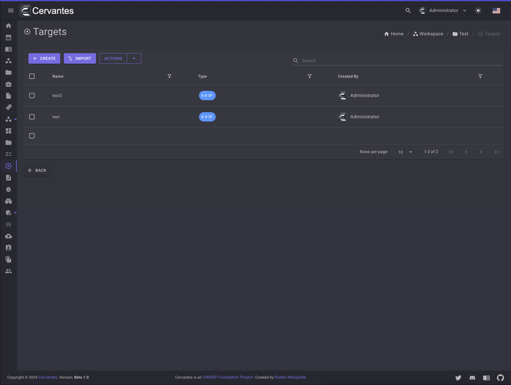{ width="800" }
  <figcaption>Targets list</figcaption>
</figure>

## Create a target

To create a target you need to click on the `Create` button and fill the form and select the target type .

<figure markdown>
  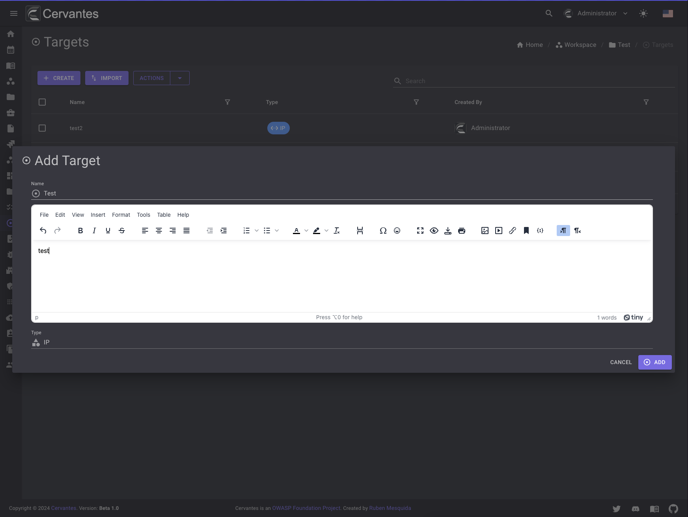{ width="800" }
  <figcaption>Create Target</figcaption>
</figure>

## Import targets

To import targets you need to click on the `Import` button and select the nmap xml or csv file.

<figure markdown>
  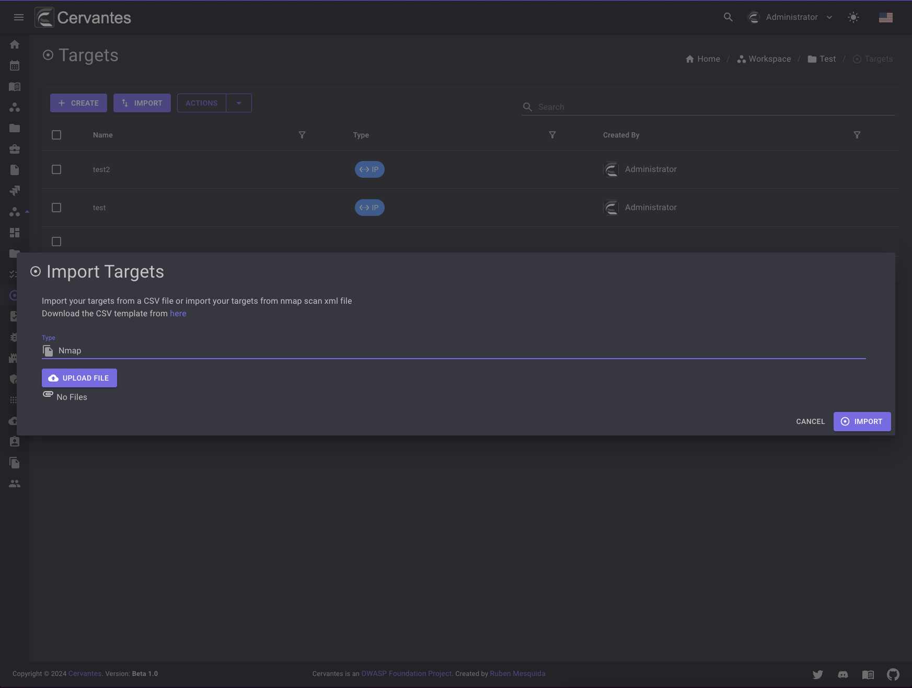{ width="800" }
  <figcaption>Import Target</figcaption>
</figure>

## Edit a target

To edit a target you need to select the target from the datagrid and click on the `Edit` button at the top right and edit the information.

<figure markdown>
  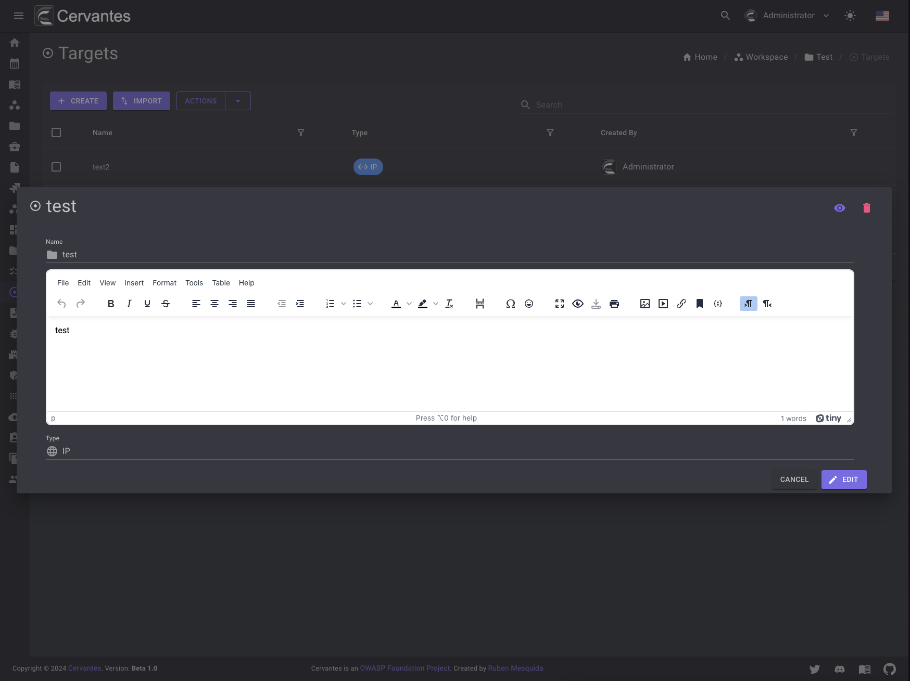{ width="800" }
  <figcaption>Edit Target</figcaption>
</figure>

## Delete a target

To delete a target you need to select the target from the datagrid and click on the `Delete` button at the top right and confirm the action.

<figure markdown>
  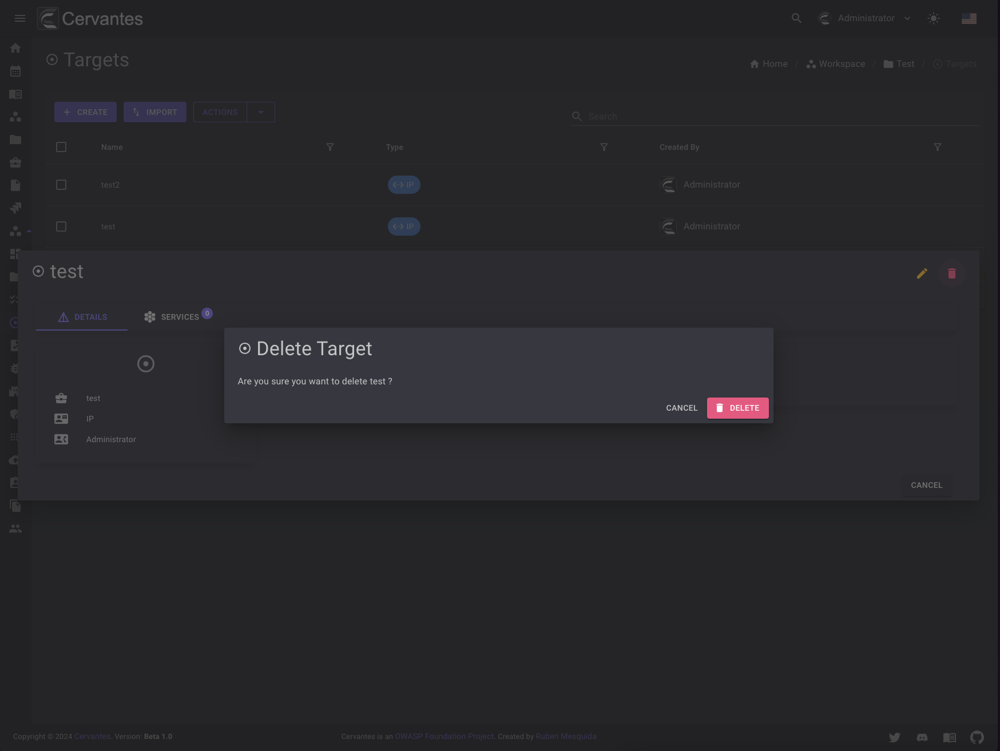{ width="800" }
  <figcaption>Target delete</figcaption>
</figure>

Also you can delete multiple targets at once by selecting them from the datagrid and click on the `Actions -> Delete` button at the top  confirm the action.

<figure markdown>
  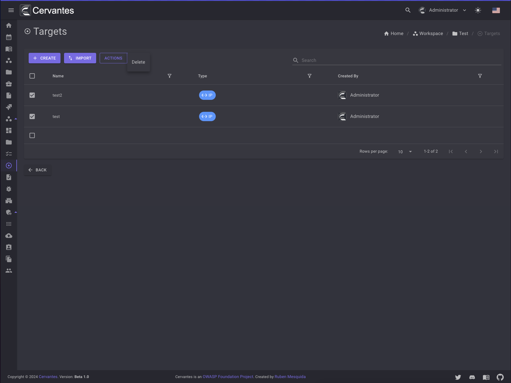{ width="800" }
  <figcaption>Target delete</figcaption>
</figure>

## Services

To access the services page you need to select a target from the datagrid and click on the `Services` tab.

<figure markdown>
  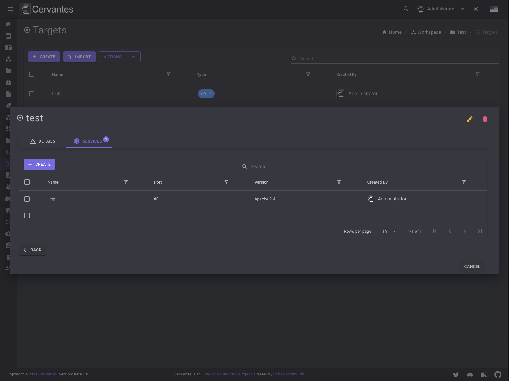{ width="800" }
  <figcaption>Target services</figcaption>
</figure>

## Create a service

To create a service you need to click on the `Create` button and fill the form.

<figure markdown>
  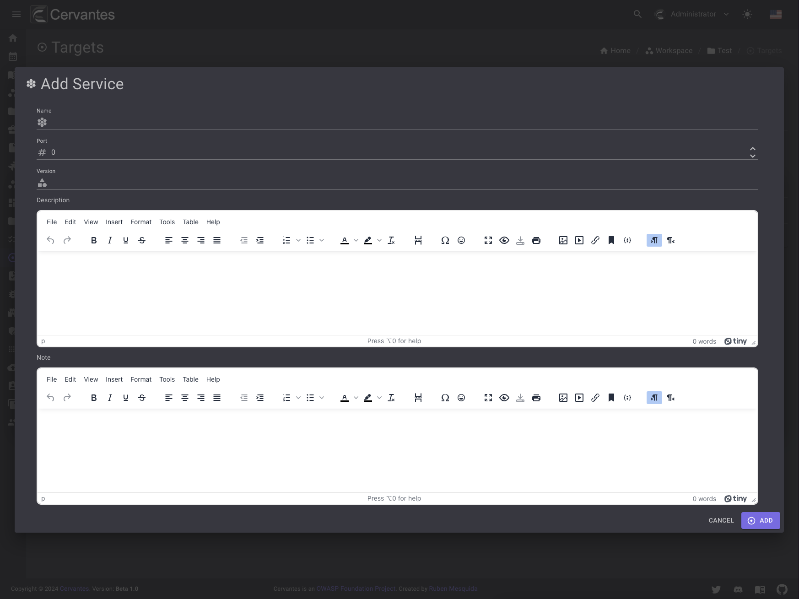{ width="800" }
  <figcaption>Create Service</figcaption>
</figure>

## Edit a service

To edit a service you need to select the service from the datagrid and click on the `Edit` button at the top right and edit the information.

<figure markdown>
  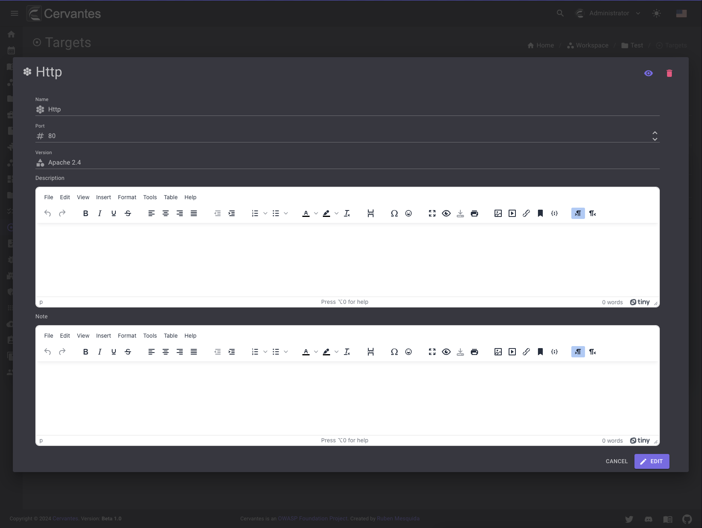{ width="800" }
  <figcaption>Edit Service</figcaption>
</figure>

## Delete a service

To delete a service you need to select the service from the datagrid and click on the `Delete` button at the top right and confirm the action.

<figure markdown>
  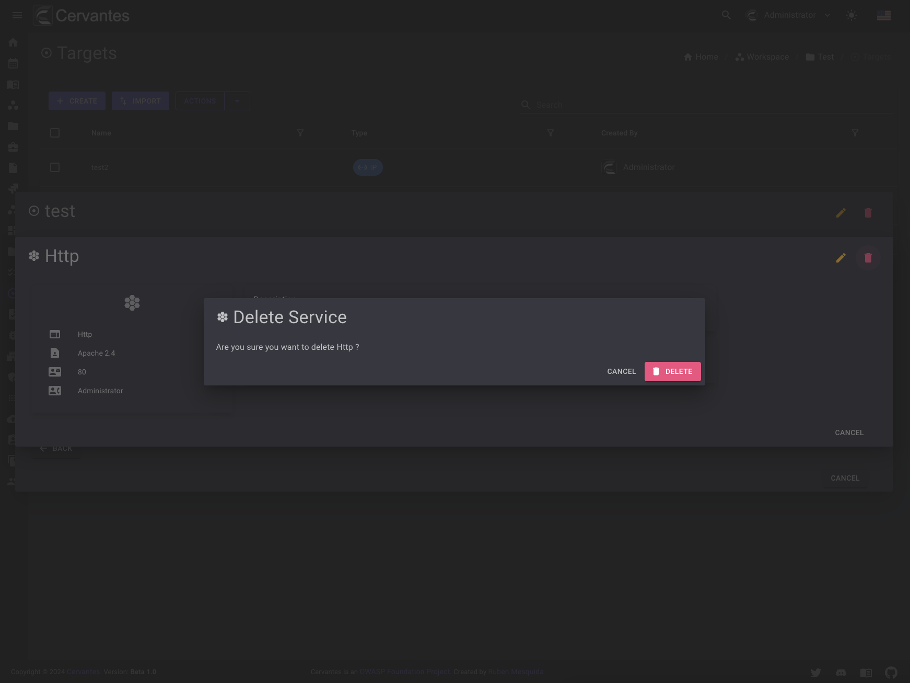{ width="800" }
  <figcaption>Service delete</figcaption>
</figure>

Also you can delete multiple services at once by selecting them from the datagrid and click on the `Actions -> Delete` button at the top  confirm the action.

<figure markdown>
  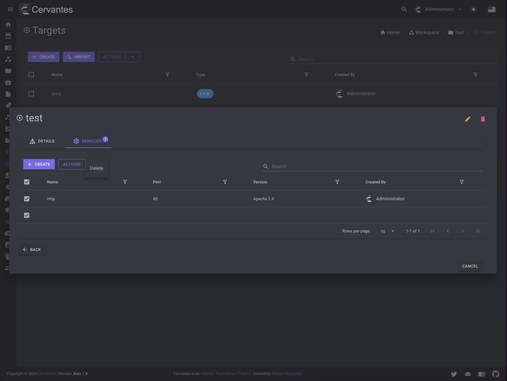{ width="800" }
  <figcaption>Service delete</figcaption>
</figure>

