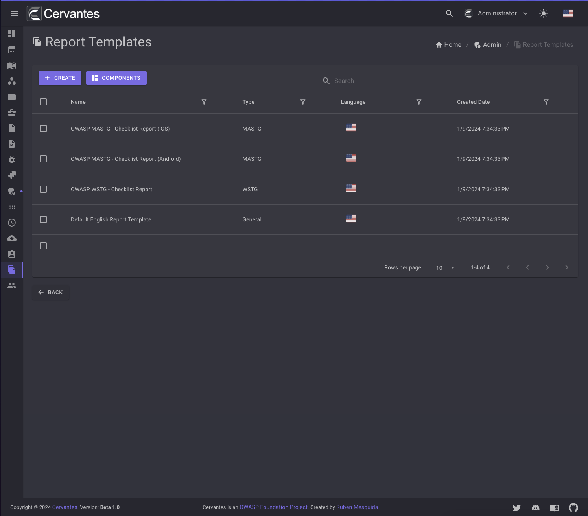
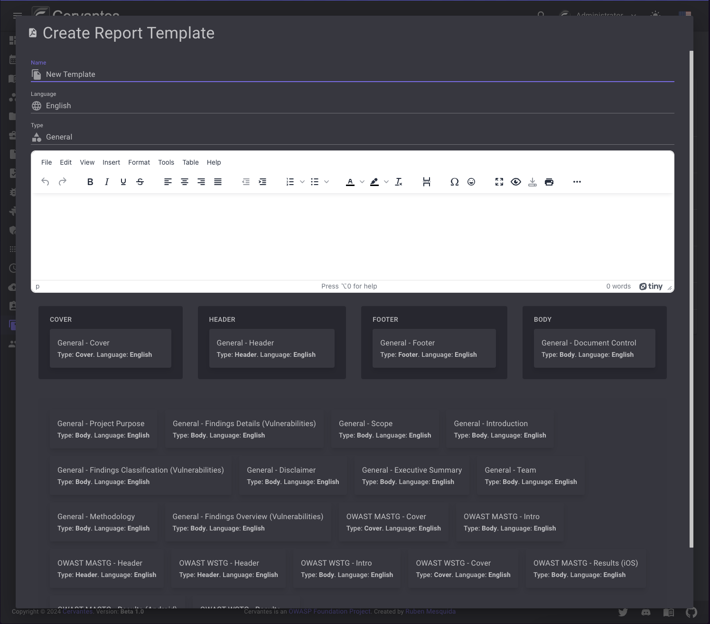
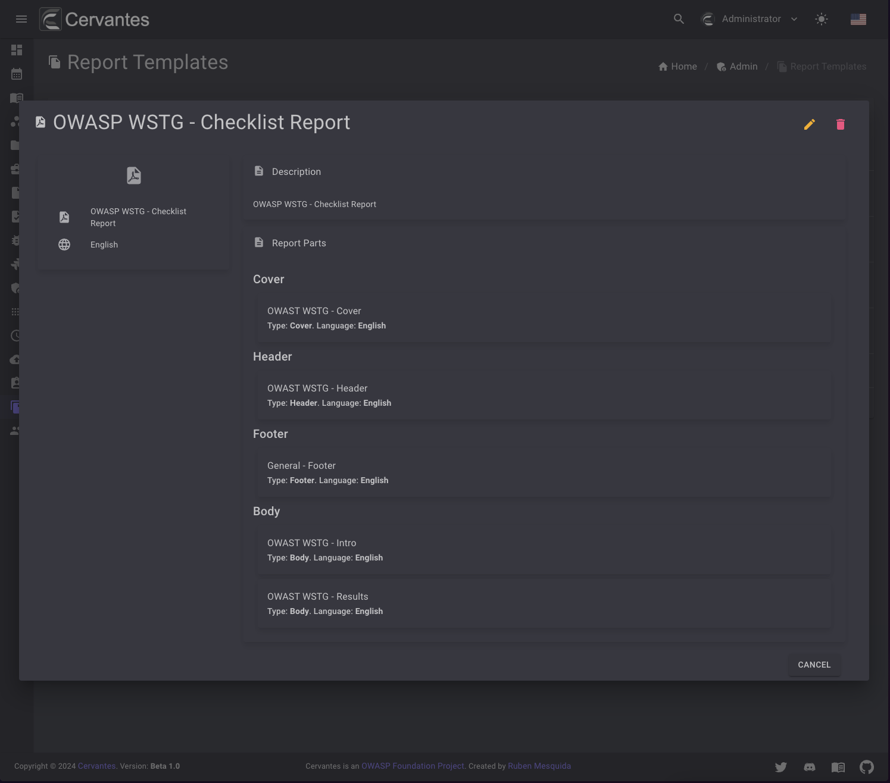
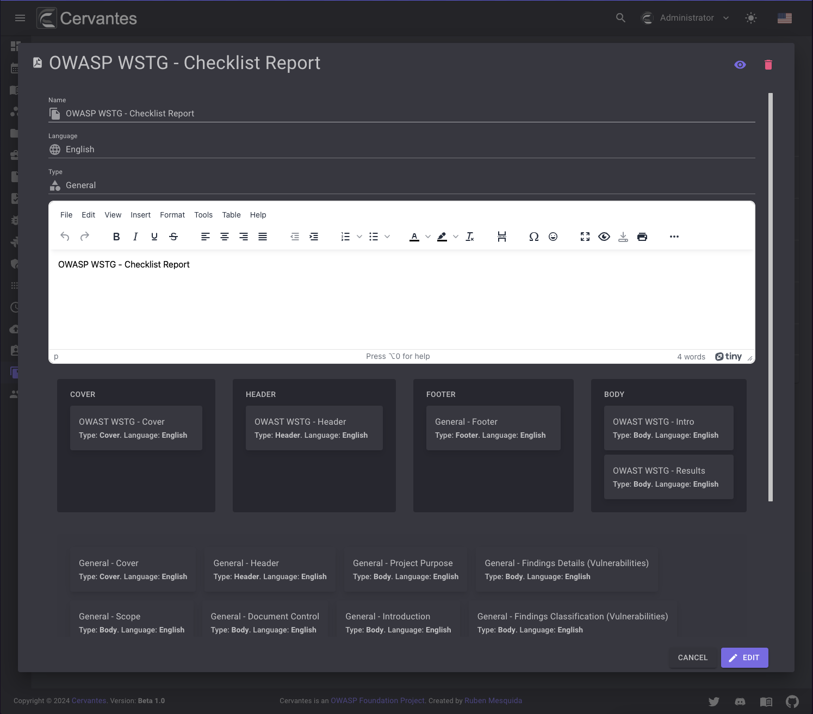
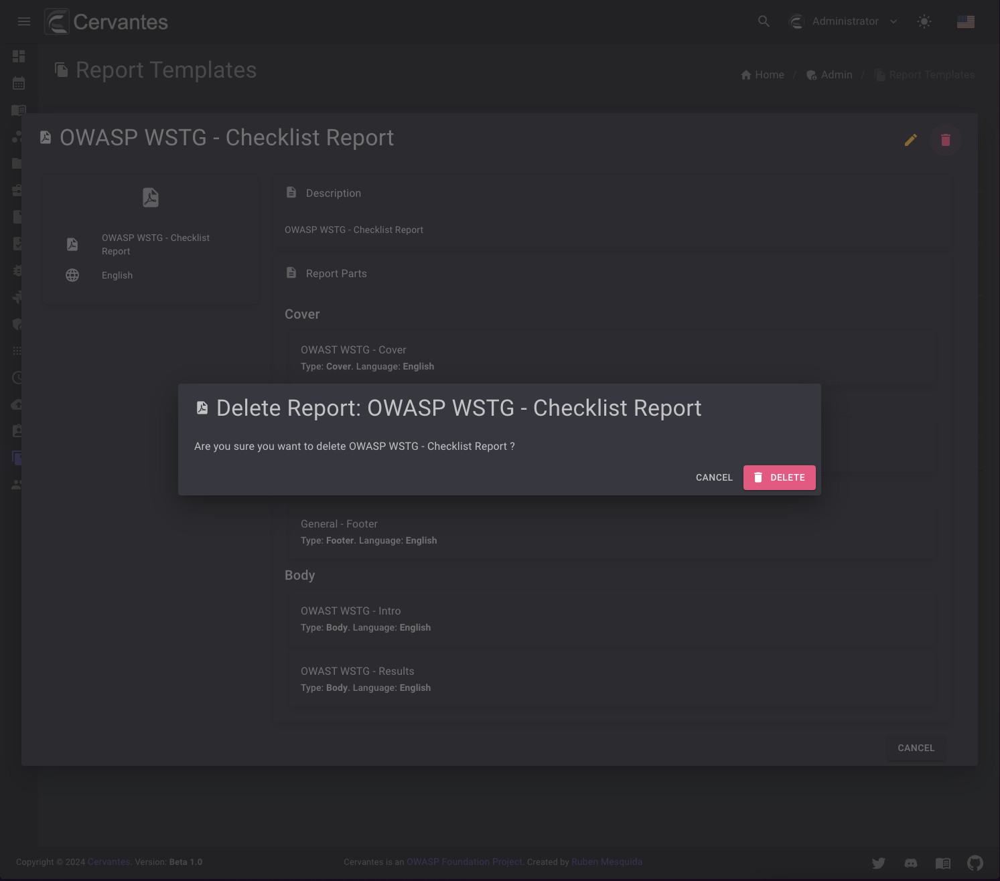
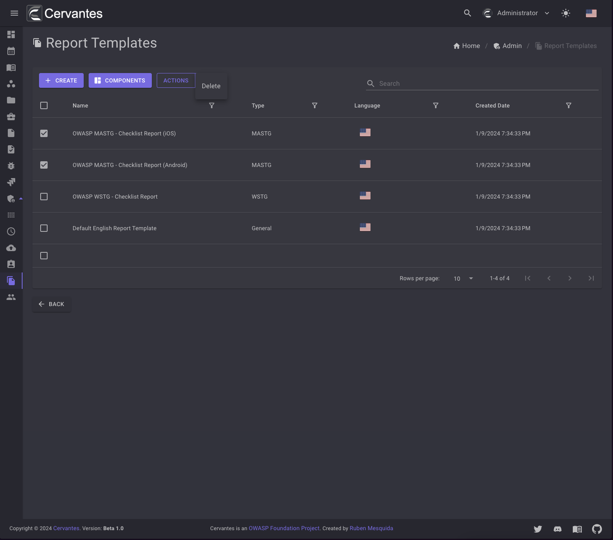

# Report Templates

The report templates are the templates that will be used to generate the reports. 
These template are built using the components that you can create in the [Components](components.md) section.

<figure markdown>
  { width="800" }
  <figcaption>Report Templates list</figcaption>
</figure>

## Create a template

To create a template you need to click on the `Create` button and fill the form and select the components that you want to use in the template with th drag and drop section.
Each section only accepts components of the same type.

<figure markdown>
  { width="800" }
  <figcaption>Create Template</figcaption>
</figure>

## Edit a template

To edit a template you need to select the template from the datagrid and a new dialog will open and you will need to click on the `Edit` button at the top right and edit the information.

<figure markdown>
  { width="800" }
  <figcaption>Dialog Template</figcaption>
</figure>

<figure markdown>
  { width="800" }
  <figcaption>Edit Template</figcaption>
</figure>

## Delete a template

To delete a template you need to select the template from the datagrid and click on the `Delete` button at the top right and confirm the action.

<figure markdown>
  { width="800" }
  <figcaption>Template delete</figcaption>
</figure>

Also you can delete multiple templates at once by selecting them from the datagrid and click on the `Actions -> Delete` button at the top  confirm the action.

<figure markdown>
  { width="800" }
  <figcaption>Bulk Template delete</figcaption>
</figure>