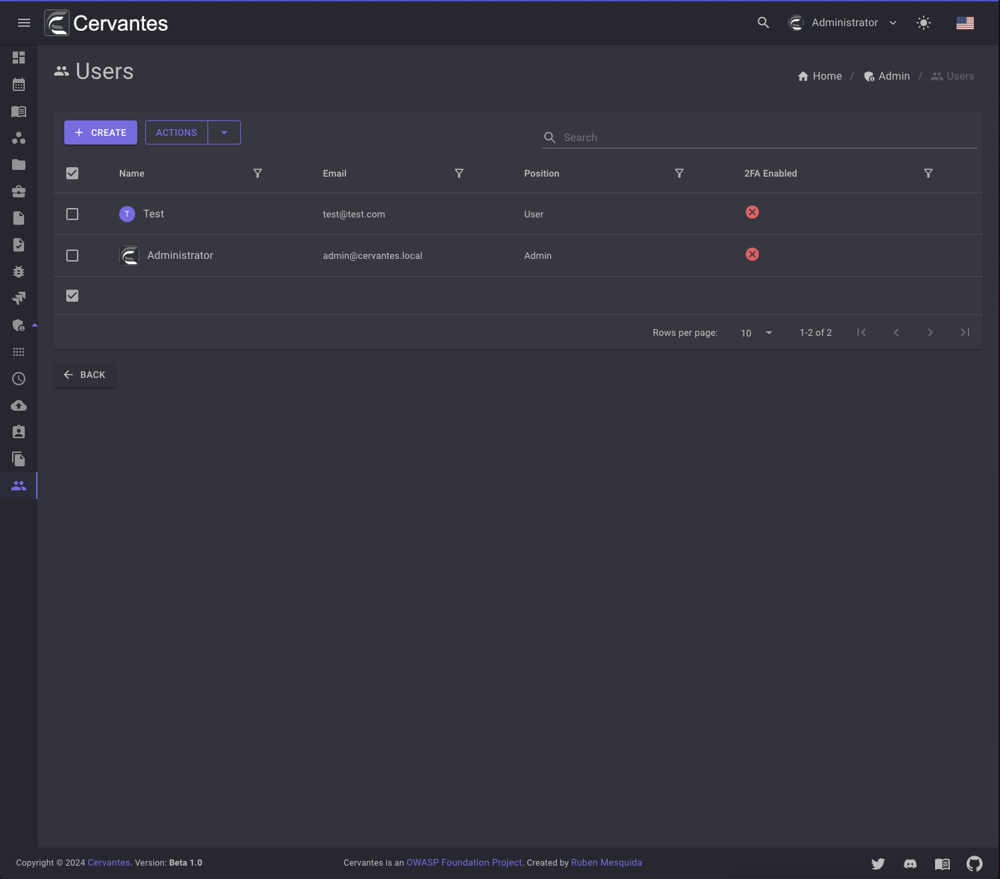
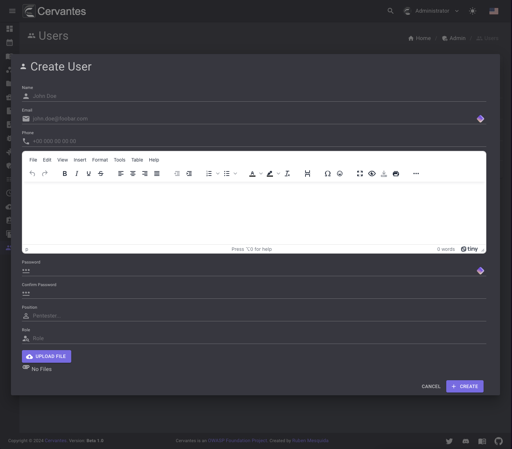
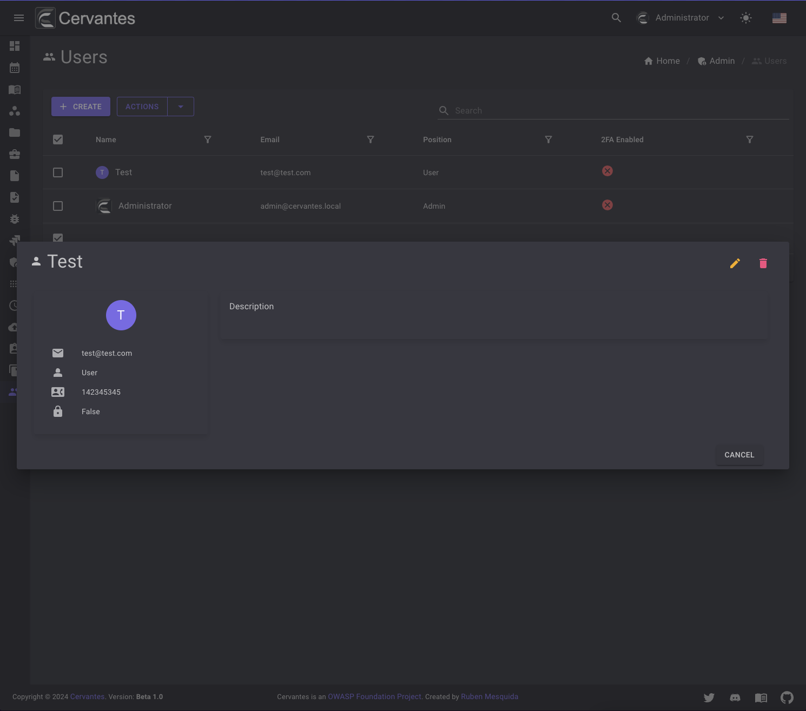
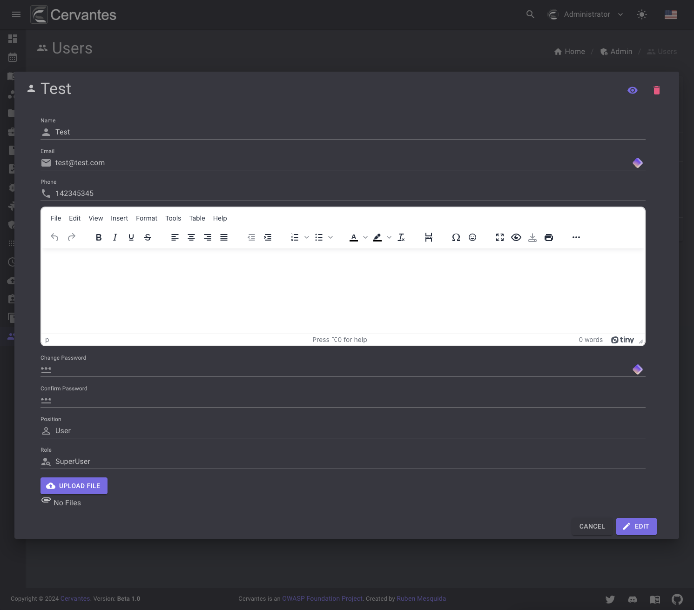
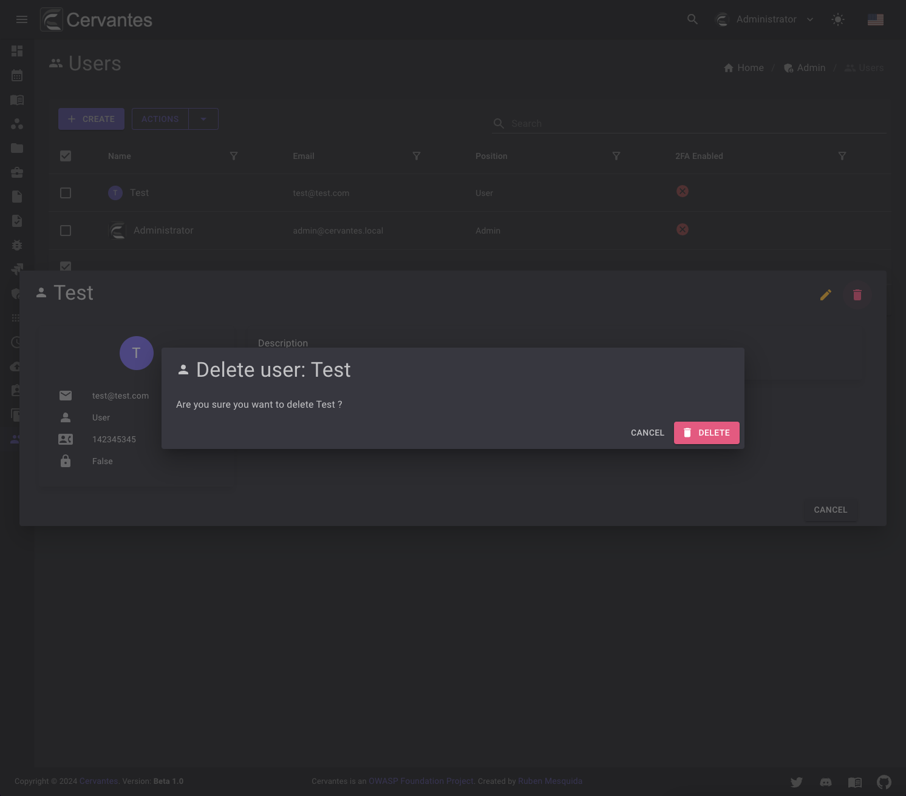
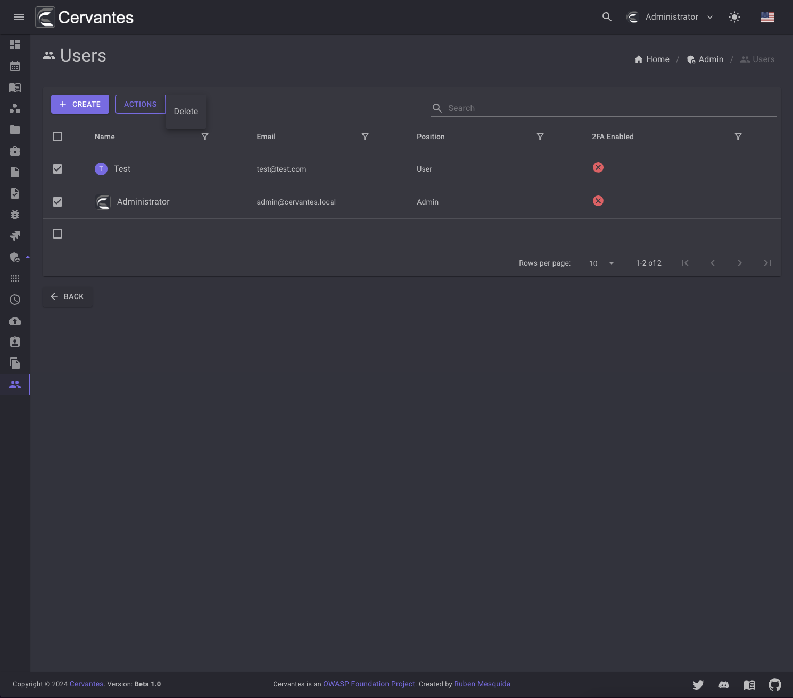

# Users

The users page allows you to manage your users. You can create, edit and delete users.

<figure markdown>
  { width="800" }
  <figcaption>Users list</figcaption>
</figure>

## Create a user

To create a user you need to click on the `Create` button and fill the form and select the user role.

<figure markdown>
  { width="800" }
  <figcaption>Create User</figcaption>
</figure>

## Edit a user

To edit a user you need to select the user from the datagrid and click on the `Edit` button at the top right and edit the information.

<figure markdown>
  { width="800" }
  <figcaption>Dialog User</figcaption>
</figure>

<figure markdown>
  { width="800" }
  <figcaption>Edit User</figcaption>
</figure>

## Delete a user

To delete a user you need to select the user from the datagrid and click on the `Delete` button at the top right and confirm the action.

<figure markdown>
  { width="800" }
  <figcaption>User delete</figcaption>
</figure>

Also you can delete multiple users at once by selecting them from the datagrid and click on the `Actions -> Delete` button at the top  confirm the action.

<figure markdown>
  { width="800" }
  <figcaption>Bulk User delete</figcaption>
</figure>
