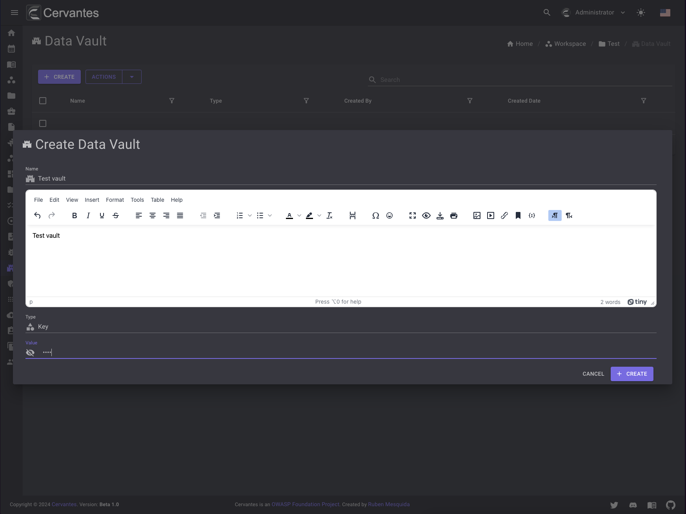

# Vaults

The vaults page allows you to manage the credentials, keys, tokens that you have found during your project. If you have acces to a workspace you can see the vaults pages.

<figure markdown>
  { width="800" }
  <figcaption>Vaults list</figcaption>
</figure>

## Create a vault

To create a vault you need to click on the `Create` button and fill the form and select the vault type.

<figure markdown>
  { width="800" }
  <figcaption>Create Vault</figcaption>
</figure>

## Edit a vault

To edit a vault you need to select the vault from the datagrid and click on the `Edit` button at the top right and edit the information.

<figure markdown>
  { width="800" }
  <figcaption>Edit Vault</figcaption>
</figure>

## Delete a vault

To delete a vault you need to select the vault from the datagrid and click on the `Delete` button at the top right and confirm the action.

<figure markdown>
  { width="800" }
  <figcaption>Vault delete</figcaption>
</figure>