# Vulnerabilities

The vulns page allows you to manage and view your vulnerabilities

<figure markdown>
  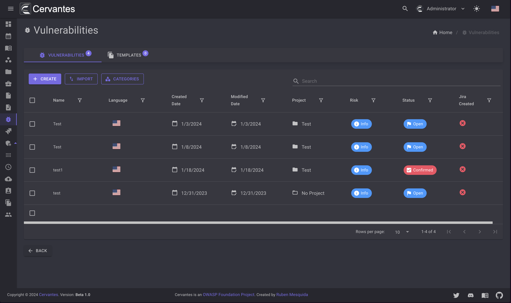{ width="800" }
  <figcaption>Vulns list</figcaption>
</figure>

## Templates

You can create templates to create vulnerabilities faster. To create a template you need to click on the `Create` button and fill the form and enable the template switch.

<figure markdown>
  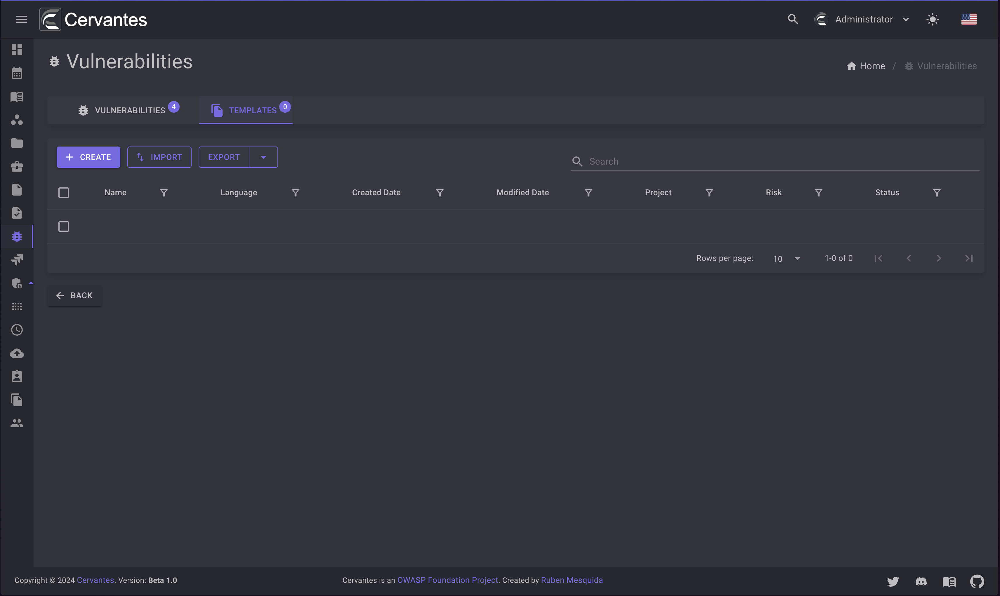{ width="800" }
  <figcaption>Create Template</figcaption>
</figure>

## Create a vulnerability

To create a vulnerability you need to click on the `Create` button and fill the form. 
Remember that you can select the project that the vulnerability belongs to and also you can add the targets and more.

<figure markdown>
  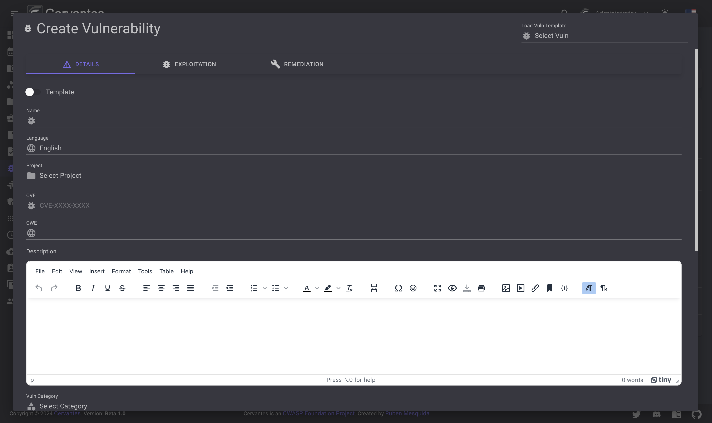{ width="800" }
  <figcaption>Create Vulnerability</figcaption>
</figure>

You can create a vulnerability from a template by clicking on the dropdown `Load Vuln Template` on the top right.

## Edit a vulnerability

To edit a vulnerability you need to select the vulnerability from the datagrid and click on the `Edit` button at the top right and edit the information.

<figure markdown>
  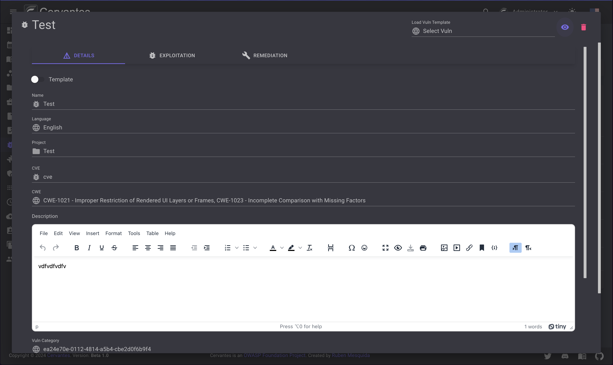{ width="800" }
  <figcaption>Edit Vulnerability</figcaption>
</figure>

## Delete a vulnerability

To delete a vulnerability you need to select the vulnerability from the datagrid and click on the `Delete` button at the top right and confirm the action.

<figure markdown>
  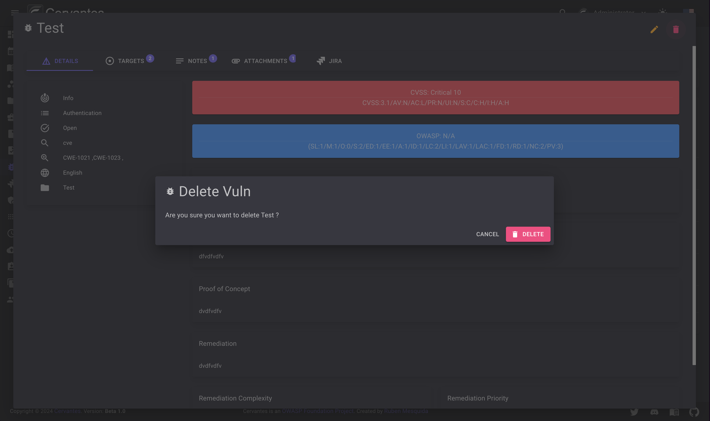{ width="800" }
  <figcaption>Vulnerability delete</figcaption>
</figure>

Also you can delete multiple vulnerabilities at once by selecting them from the datagrid and click on the `Actions -> Delete` button at the top  confirm the action.

<figure markdown>
  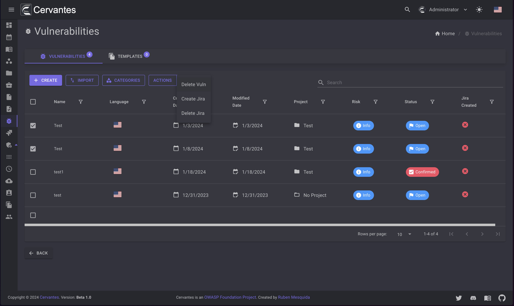{ width="800" }
  <figcaption>Vulnerabilities bulk delete</figcaption>
</figure>

## Details

To access the vulnerability details you need to select the vulnerability from the datagrid. On the vulnerability details page you can see the vulnerability information, members, vulnerabilities etc.

<figure markdown>
  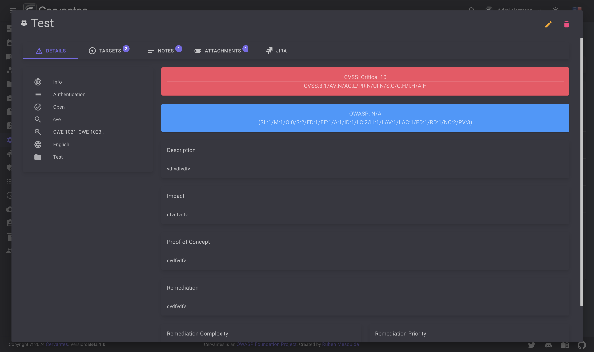{ width="800" }
  <figcaption>Vulnerability details</figcaption>
</figure>

### Targets

On the targets tab you can see the targets that the vulnerability has.

<figure markdown>
  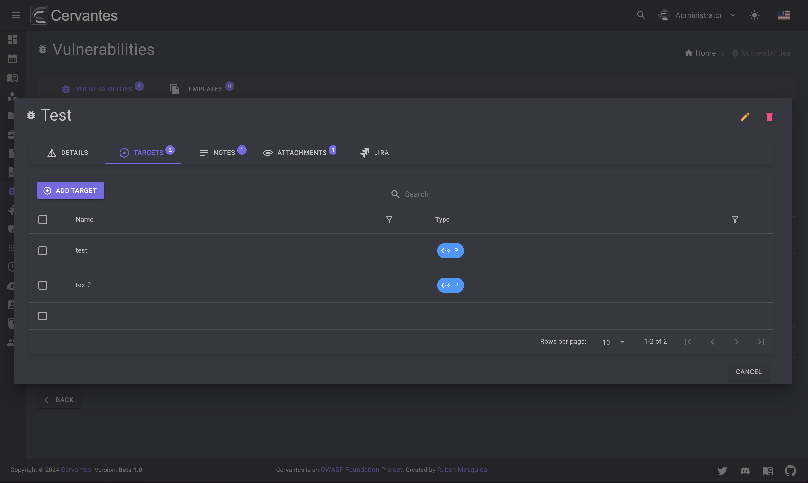{ width="800" }
  <figcaption>Vulnerability targets</figcaption>
</figure>

To add a target to the vulnerability you need to click on the `Add` button and select the vulnerability on the dropdown and click on the `Add` button.

<figure markdown>
  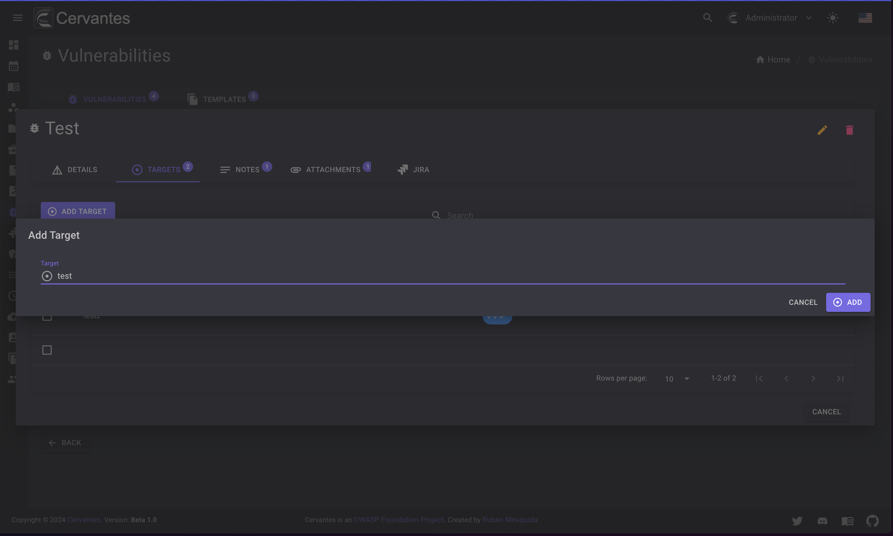{ width="800" }
  <figcaption>Add target to vulnerability</figcaption>
</figure>

To delete a target from the vulnerability you need to select the target from the datagrid and confirm the delete action.

<figure markdown>
  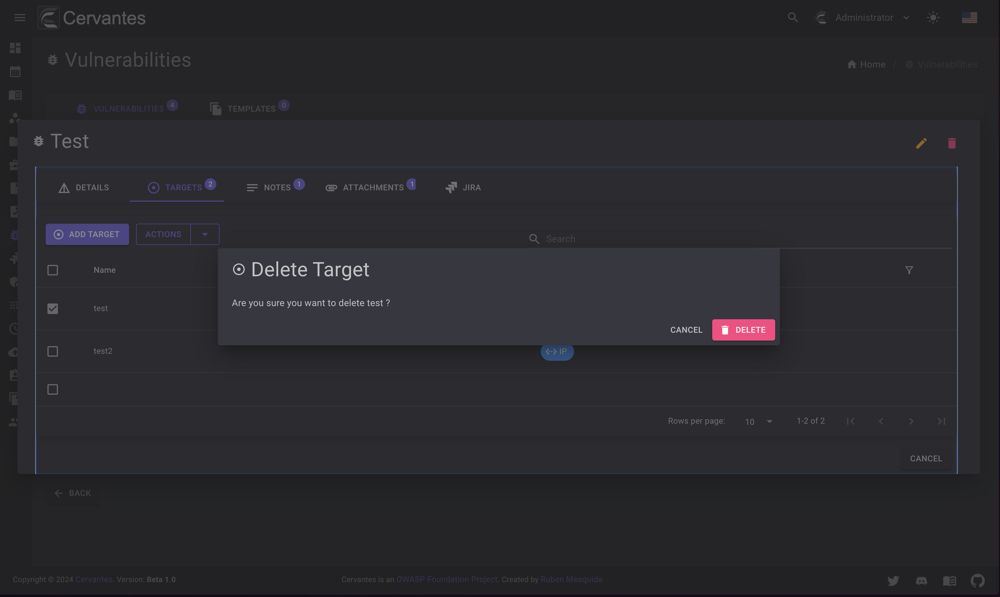{ width="800" }
  <figcaption>Delete target from vulnerability</figcaption>
</figure>

### Notes

On the notes tab you can see the notes that the vulnerability has.

<figure markdown>
  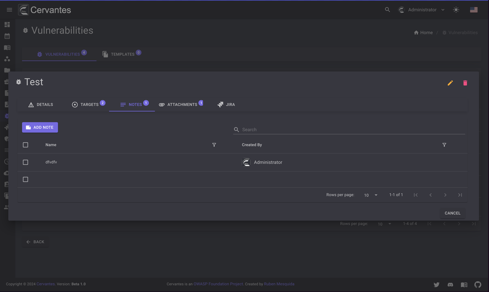{ width="800" }
  <figcaption>Vulnerability notes</figcaption>
</figure>

To add a note to the vulnerability you need to click on the `Add` button and select the vulnerability on the dropdown and click on the `Add` button.

<figure markdown>
  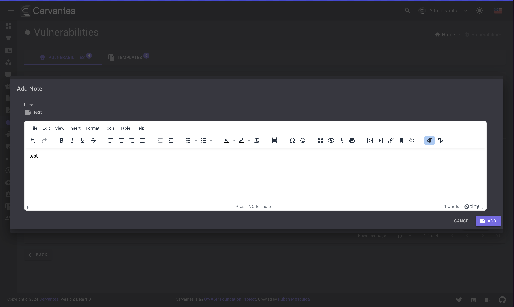{ width="800" }
  <figcaption>Add note to vulnerability</figcaption>
</figure>

To edit a note you need to select the note from the datagrid and click on the `Edit` button at the top right and edit the information.

<figure markdown>
  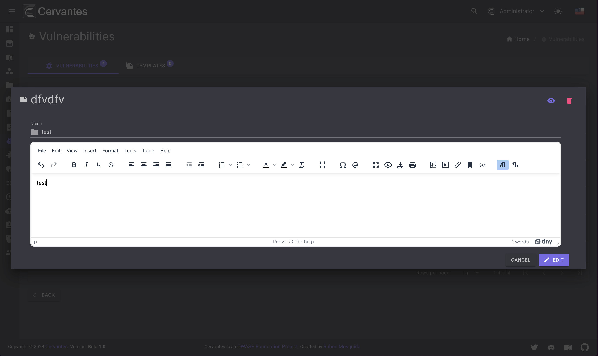{ width="800" }
  <figcaption>Edit note from vulnerability</figcaption>
</figure>

To delete a note from the vulnerability you need to select the note from the datagrid and confirm the delete action.

<figure markdown>
  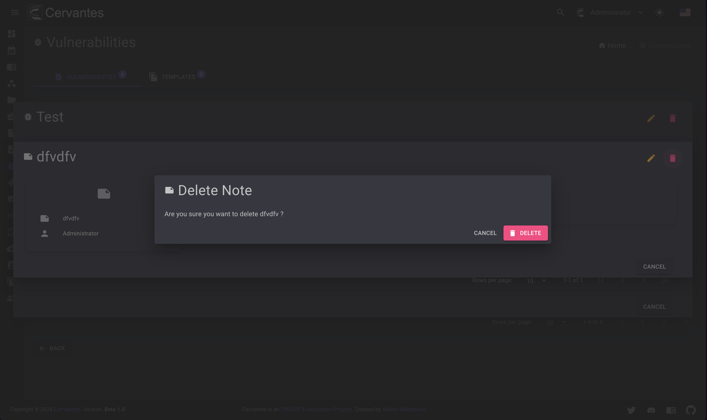{ width="800" }
  <figcaption>Delete note from vulnerability</figcaption>
</figure>

### Attachments

On the attachments tab you can see the attachments that the vulnerability has.

<figure markdown>
  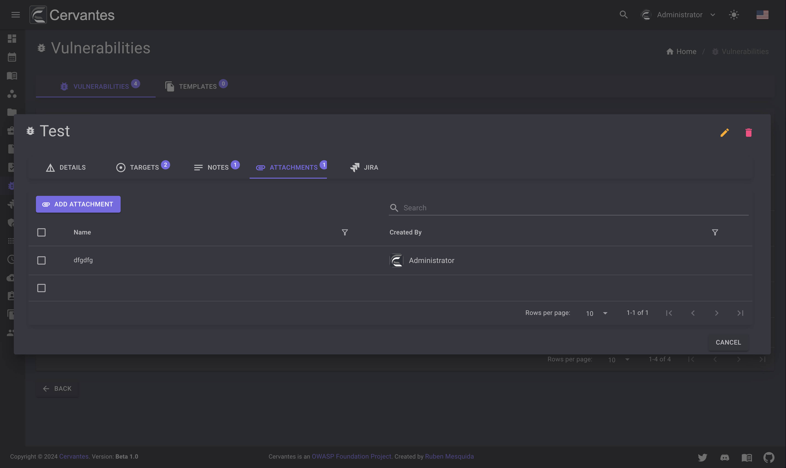{ width="800" }
  <figcaption>Vulnerability attachments</figcaption>
</figure>

To add an attachment to the vulnerability you need to click on the `Add` button and select the vulnerability on the dropdown and click on the `Add` button.

<figure markdown>
  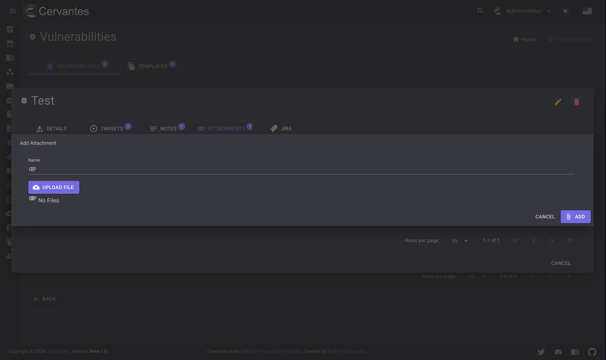{ width="800" }
  <figcaption>Add attachment to vulnerability</figcaption>
</figure>

To download an attachment you need to select the attachment from the datagrid and click on the `Download` button at the top right and download the attachment.

<figure markdown>
  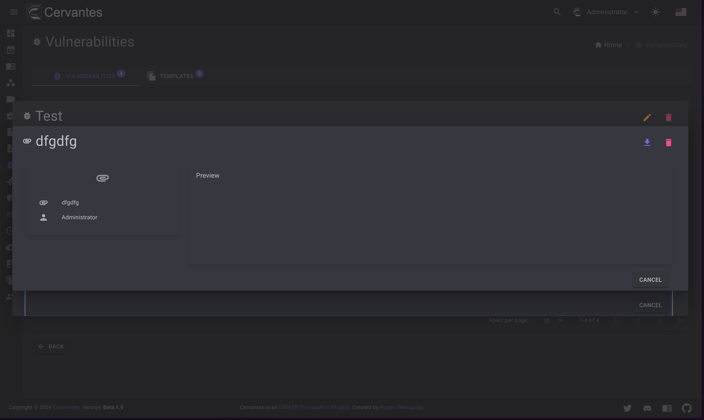{ width="800" }
  <figcaption>Edit attachment from vulnerability</figcaption>
</figure>

To delete an attachment from the vulnerability you need to select the attachment from the datagrid and confirm the delete action.

<figure markdown>
  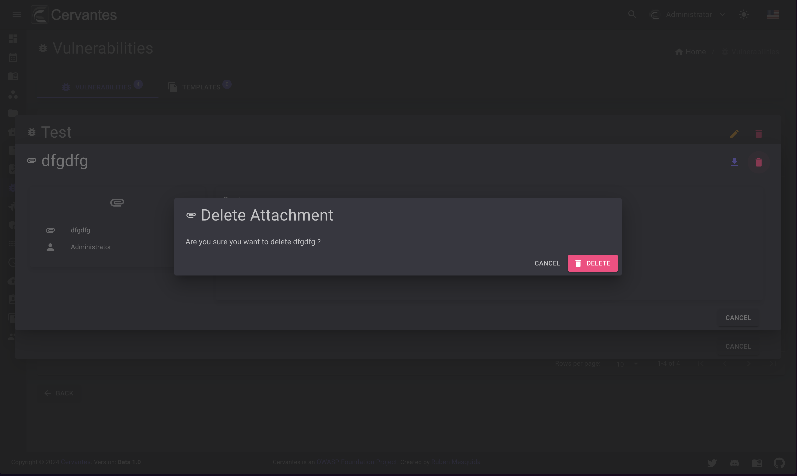{ width="800" }
  <figcaption>Delete attachment from vulnerability</figcaption>
</figure>

### Jira

On the Jira tab you can see or create the Jira issue associated with the vulnerability.
If the vulnerability has a Jira issue you can see the issue information and the comments.

<figure markdown>
  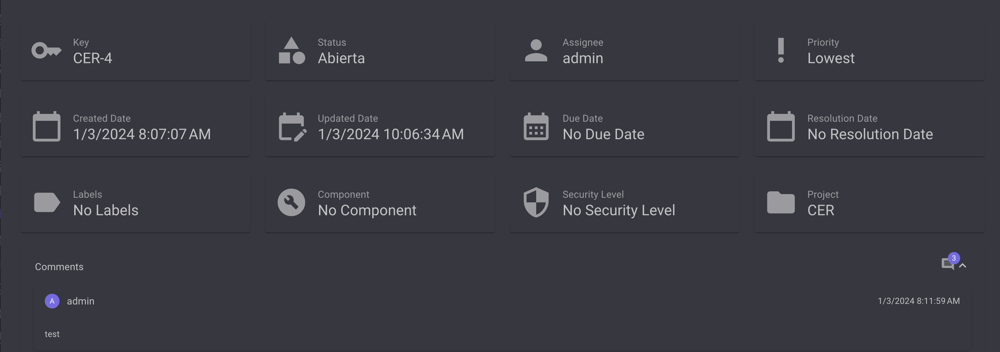{ width="800" }
  <figcaption>Vulnerability Jira</figcaption>
</figure>

If the vulnerability doesn't have a Jira issue you can create one by clicking on the `Create` button.

<figure markdown>
  { width="800" }
  <figcaption>Create Jira issue</figcaption>
</figure>