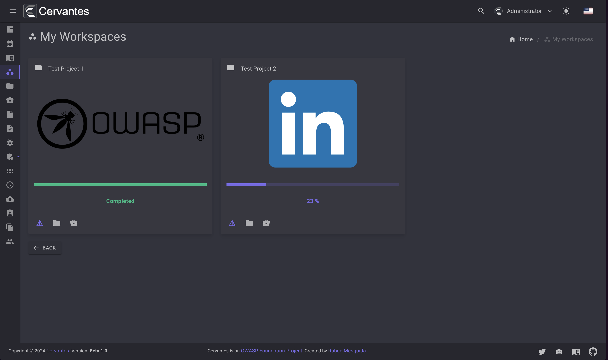
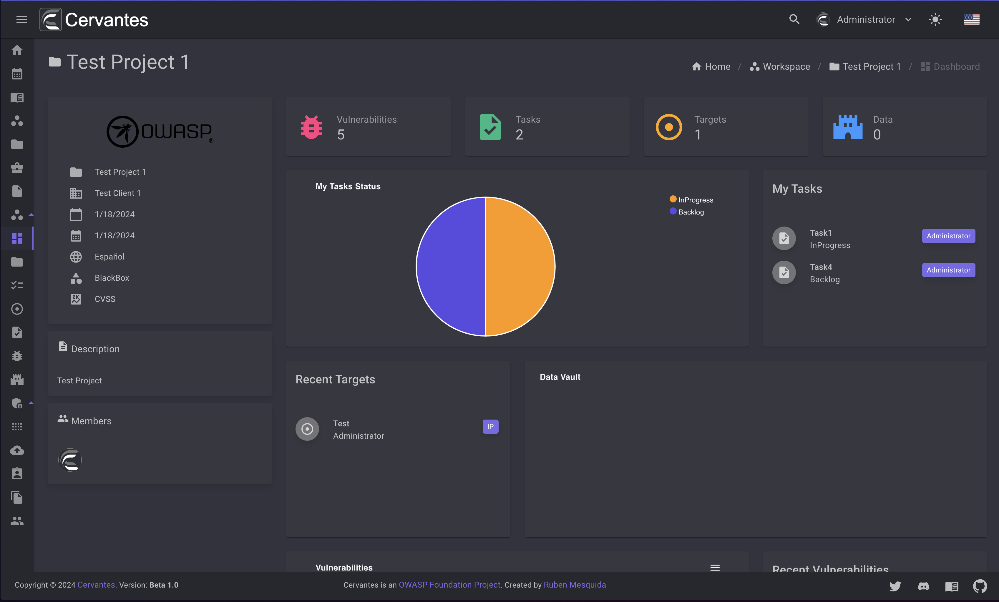
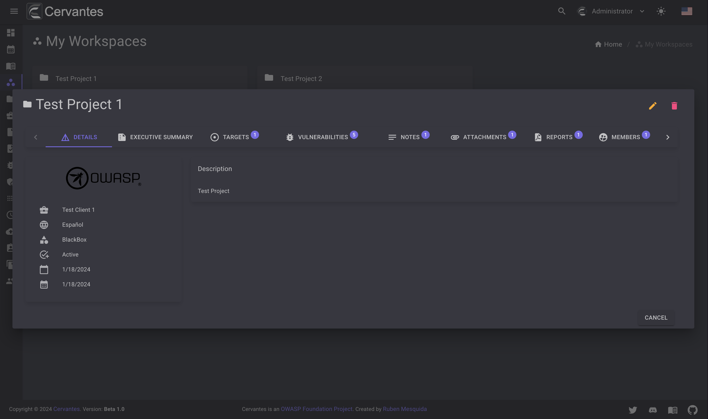
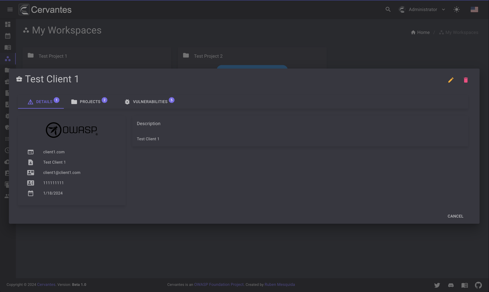

# Workspaces

The workspaces page will show you all the workspaces that you have access to. 
Basically a workspace is a an active project where you have been added as a member.

<figure markdown>
  { width="800" }
  <figcaption>Workspaces</figcaption>
</figure>

On each workspace at bottom you can see three options:

- **Go to workspace** (Purple button) -  This option will redirect you to the workspace page.

<figure markdown>
  { width="800" }
  <figcaption>Workspace</figcaption>
</figure>

- **Project** (Folder button) - This option will show you a dialog where you can see the project details

<figure markdown>
  { width="800" }
  <figcaption>Project details</figcaption>
</figure>

- **Client** (Briefcase button) - This option will show you a dialog where you can see the client details

<figure markdown>
  { width="800" }
  <figcaption>Client details</figcaption>
</figure>